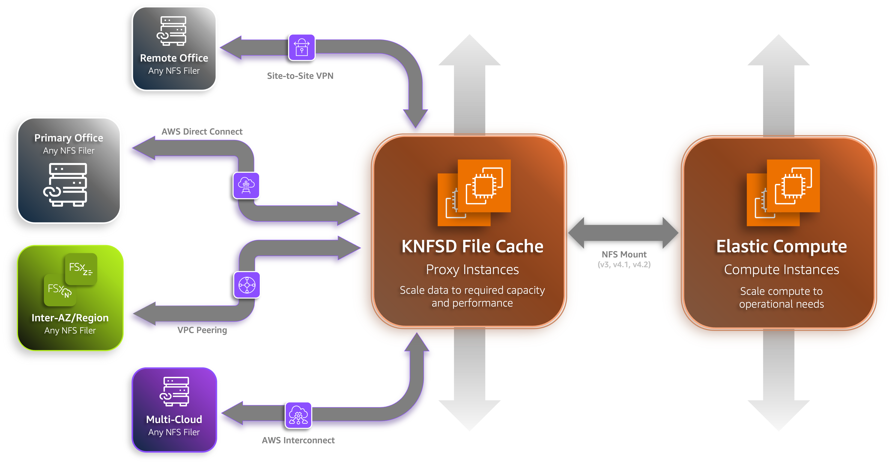
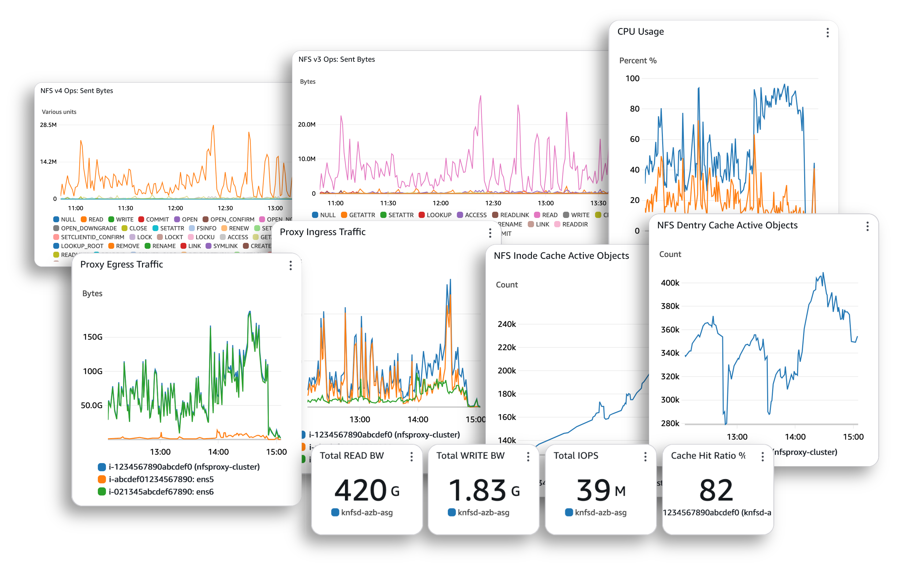

# KNFSD File Cache

https://github.com/user-attachments/assets/d54a5992-bd9a-4ded-be06-3d10111a57c1

Please log issues/feature requests in [GitHub](https://github.com/awslabs/knfsd-file-cache/issues). Contact: [knfsd-file-cache@amazon.com](mailto:knfsd-file-cache@amazon.com)

## Overview

This repository contains a set of utilities for building, deploying and operating a high performance NFS cache in Amazon Web Services (AWS). It is designed to be used for certain HPC and burst compute use-cases where there is a requirement for a high performance NFS cache between a NFS server and its downstream NFS clients.

This solution is based on existing Linux kernel modules, including `nfs-kernel-server` which supports NFS re-exporting and `cachefilesd` (FS-Cache) which provides a persistent cache of network file systems on disk.

The solution works by mounting NFS exports from a source NFS filer (typically located on-premise) and re-exporting the mount points to downstream NFS clients in AWS.

Performing this re-export provides two layers of caching:

* **Level 1:** The standard block cache of the operating system, residing in RAM.
* **Level 2:** FS-Cache. A Linux kernel module which caches data from network file systems locally on disk as pages. When the volume of data exceeds available RAM (L1), the data is cached on the disk by FS-Cache. In this deployment, we use local NVMe volumes for the L2 cache, although this could be configured in a number of ways, including using EBS volumes.

Using the deployment scripts in this repository, we further extend this architecture by creating multiple NFS proxies in an [Auto Scaling Group](https://docs.aws.amazon.com/autoscaling/ec2/userguide/auto-scaling-groups.html) and using either DNS round-robin or a [Network Load Balancer](https://docs.aws.amazon.com/elasticloadbalancing/latest/network/introduction.html) to manage connections between the NFS clients and NFS cache.

The NFS caching solution is collectively referred to as `KNFSD` in this repository.

## Documentation

The [docs](./docs/index.md) directory provides comprehensive documentation for the solution.

## Building and Deploying

This repository is broken down into two key sections:

1. [Build KNFSD](image/)
2. [Deploy KNFSD](deployment/)

You should start with the [Packer build](image/). Once built, you can use this Amazon Machine Image (AMI) and the [Terraform module](deployment/) to deploy and operate a KNFSD cluster on AWS.

## Metrics

KNFSD provides a number of metrics for monitoring and observability. These are collected by the [Amazon CloudWatch Agent](https://docs.aws.amazon.com/AmazonCloudWatch/latest/monitoring/CloudWatch-Agent.html) and [KNFSD Metrics Agent](image/resources/knfsd-metrics-agent/README.md) and published to Amazon CloudWatch. See the [Metrics Dashboard](deployment/metrics/README.md) documentation for more details. Third party tools can also be used to collect and visualise the Open-Telemetry based metrics, such as [Prometheus](https://prometheus.io/) and [Grafana](https://grafana.com/). Client-side metrics can be collected by the [KNFSD Metrics Agent](image/resources/knfsd-metrics-agent/README.md) running on the NFS client instances. See the [Client Metrics](docs/client-metrics.md) documentation for more details.

## Dev Container

Two optional but recommended Dev Containers are provided:

1. `.devcontainer/prod`
2. `.devcontainer/dev`

For end users, the `.devcontainer/prod` container provides the minimum configuration for a production environment to build, deploy, and operate the KNFSD image.

For developers, the [`.devcontainer/dev`](./docs/developer.md) container provides a fully featured development environment for all parts of this project.

## License

This project is licensed under the Apache-2.0 License. See the [LICENSE](./LICENSE) file for details. See the [THIRD-PARTY-LICENSES](./THIRD-PARTY-LICENSES) file for licenses referenced by our dependencies.

Copyright Amazon.com, Inc. or its affiliates. All Rights Reserved.

Unless required by applicable law or agreed to in writing, software distributed under the License is distributed on an "AS IS" BASIS, WITHOUT WARRANTIES OR CONDITIONS OF ANY KIND, either express or implied.
