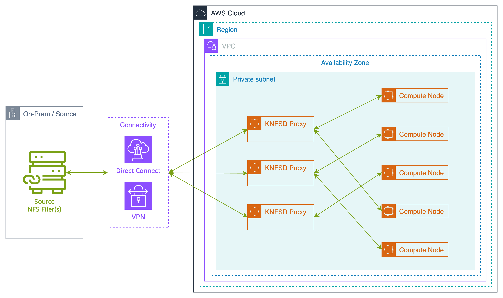
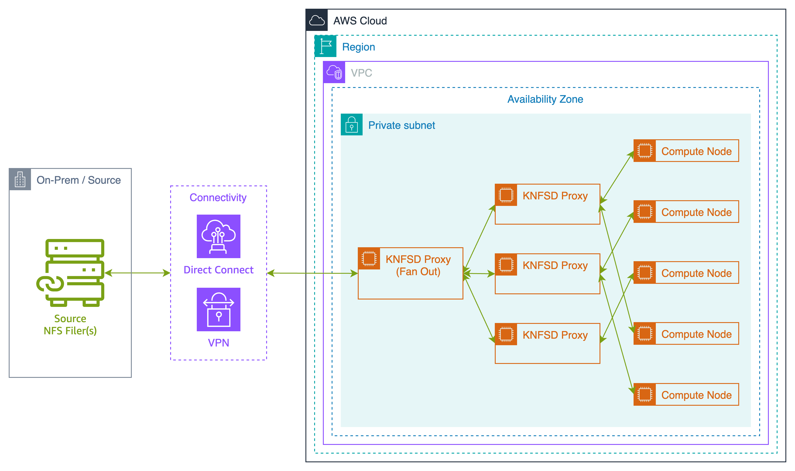

# Fan Out Architecture

> INFO: This architecture requires the use of NFS v4.

> WARNING: Ensure the **fanout** EC2 `INSTANCE_TYPE` is at least 2x-8x more powerful than the **cluster** EC2 `INSTANCE_TYPE` (use a larger size).

## Overview

In the standard architecture, one layer of KNFSD proxies are deployed that sit between the downstream clients and the on-premise/source NFS server. This approach is shown in the below diagram:



This approach is the simplest deployment architecture, and also the most performant when it comes to reading uncached files, and writing files back through to the on-premise/source NFS server.

However in this model, as the KNFSD proxies in a cluster do not share cached items with each other, having multiple KNFSD proxies means that often files are transferred across the network multiple times. This is because different downstream clients might be connected to different KNFSD proxies, meaning that even if 2 downstream clients are requesting the same file, that file may need to be pulled from on-premise/source twice.

One approach to mitigating this challenge is to deploy two KNFSD clusters in a "fanout" or "2-tier" architecture. This approach is shown in the below diagram:



In this architecture, a single KNFSD proxy is deployed that is responsible for all communication back to the on-premise filer (the fanout proxy). A second KNFSD cluster is then deployed that connects to this fanout proxy. Downstream NFS clients all connect to this second cluster.

This architecture mitigates the challenges around duplicate file transfers from on-premise. The fanout proxy acts as the primary cache, and the second cluster is deployed to prevent overloading the fanout cache. This reduces the volume of data that needs to be transferred over the VPN/Direct Connect (DX) connection.

## Considerations

While this architecture can provide performance benefits for certain use-cases, there are some considerations that need to be made:

1. The KNFSD fanout proxy has the potential to act as a performance botleneck, but conversely it can dramatically reduce the bandwidth consumed over the VPN/DX connection by reducing the volume of duplicated file transfers.
2. First time reads, and writes back to on-premise/source will be less performant as there is an additional hop involved.
3. The cost of running the KNFSD infrastructure will increase due to additional proxies. However this may be offset by enabling a smaller VPN/DX link.
4. Adding an additional re-export layer adds up to an additional 25 bytes to the filehandle. This means that NFSv4 must be used for the re-exports as NFSv3 has a 64-byte filehandle size limit.

## Example Deployment of Fanout Architecture

The KNFSD Terraform module is defined twice to achieve the fanout deployment. The below code block shows an example deployment of the fanout architecture. We deploy a single RDS PostgreSQL database for the `nfs_proxy_fanout` module, and then reuse this database for the `nfs_proxy_cluster` module.

We ensure that the `nfs_proxy_cluster` module is deployed after the `nfs_proxy_fanout` module via the `depends_on` and `ENABLE_STATUS_CHECK` parameters.

1. The module `nfs_proxy_fanout` defines the single KNFSD proxy responsible for connecting to on-premise/source.
2. The module `nfs_proxy_cluster` defines the three KNFSD proxies that connect to the fanout proxy. Downstream NFS clients all connect to these cluster proxies.

The [fsx-zfs-fanout](../../examples/fsx-zfs-fanout/README.md) example provides a `ZFS (source) <-> tier-1 (fanout) <-> NLB <-> tier-2 (cluster) <-> NLB` example of the fanout architecture. The below code block shows the relevant sections of a generic fanout implementation in a `main.tf` file.

```terraform
module "nfs_proxy_fanout" {
  source                = "github.com/awslabs/knfsd-file-cache/deployment/terraform-module-knfsd?ref=v1.1.0-alpha.19"
  SUBNET                = var.SUBNET
  TRAFFIC_MODE          = "loadbalancer"
  PROXY_AMI             = var.PROXY_AMI
  INSTANCE_TYPE         = "i3en.12xlarge"                        # Use a higher CPU and Memory machine type to increase fanout performance
  KNFSD_NODES           = 1                                      # Only deploy 1 proxy in the cluster because we want a single fanout proxy
  EXPORT_MAP            = "10.0.5.5;/remoteexport;/remoteexport" # Define the exports in the standard way
  PROXY_BASENAME        = "nfsproxy-fanout"                      # Give this proxy a unique base name
  DNS_NAME              = "nfsproxy-fanout.aws.internal."        # Use a unique private DNS name for the fanout proxy
  NFS_MOUNT_VERSION     = "4.1"                                  # Must use NFSv4.1 for fanout due to filehandle size limitations in NFSv3
  DISABLED_NFS_VERSIONS = "3,4.0,4.2"                            # Only allow NFSv4.1 on exports due to additional filehandle size, allow NFSv3 for "showmount"
  ENABLE_STATUS_CHECK   = true                                   # Enable status check to hold the deployment until all EC2 instances are status:ready
}

module "nfs_proxy_cluster" {
  source                   = "github.com/awslabs/knfsd-file-cache/deployment/terraform-module-knfsd?ref=v1.1.0-alpha.19"
  SUBNET                   = var.SUBNET
  TRAFFIC_MODE             = "loadbalancer"
  PROXY_AMI                = var.PROXY_AMI
  FSID_DATABASE_DEPLOY     = false                                                                                    # Reuse the database from the fanout module
  FSID_DATABASE_CONFIG     = module.nfs_proxy_fanout.database_config                                                  # database configuration from the fanout module
  FSID_DATABASE_IAM_POLICY = module.nfs_proxy_fanout.database_iam_policy                                              # ARN of the IAM policy for rds-db:connect database access from the fanout module
  INSTANCE_TYPE            = "i3en.6xlarge"                                                                           # Use a smaller CPU and memory machine type as we have multiple proxies in the cluster
  KNFSD_NODES              = 3                                                                                        # Deploy 3 knfsd proxies for the performant based, temporary cache nodes
  EXPORT_MAP               = "${module.nfs_proxy_fanout.nfsproxy_loadbalancer_ipaddress};/remoteexport;/remoteexport" # Re-export the export from the fanout proxy
  PROXY_BASENAME           = "nfsproxy-cluster"                                                                       # Give this cluster a unique base name
  DNS_NAME                 = "nfsproxy-cluster.aws.internal."                                                         # Use a unique private DNS name for the cluster proxy
  NFS_MOUNT_VERSION        = "4.1"                                                                                    # Mount the fanout proxy as NFSv4.1 due to filehandle size limitations in NFSv3
  DISABLED_NFS_VERSIONS    = "3,4.0,4.2"                                                                              # Only allow NFSv4.1 on exports due to additional filehandle size
  depends_on               = [module.nfs_proxy_fanout.cluster_ready]                                                  # Deploy after "nfs_proxy_fanout" status is "ready" (TAG:knfsd-file-cache:status=ready)
}

output "load_balancer_ip_address" {
  description = "The IP address of the Network Load Balancer that the NFS clients will connect to."
  value       = module.nfs_proxy_cluster.nfsproxy_loadbalancer_ipaddress
}

output "load_balancer_dns_address" {
  description = "The DNS address of the Network Load Balancer that the NFS clients will connect to."
  value       = module.nfs_proxy_cluster.nfsproxy_loadbalancer_dnsaddress
}
```
