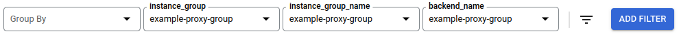

# KNFSD Proxy Metrics

This modules configures an Amazon CloudWatch custom dashboard.

> NOTE: This module only needs to be applied once per AWS account, regardless of the number of KNFSD deployments you have in the account.

## Usage

```terraform
module "metrics" {
    source  = "github.com/awslabs/knfsd-file-cache/deployment/metrics?ref=v1.1.0-alpha.2"
    project = "my-aws-account"
}
```

## Inputs

* `project` - (Required) The Google Cloud Project that the KNFSD Metrics are being deployed to.

### Provider Default Values

The Terraform module also supports supplying the project, region and zone using provider default values. Set the project, region, and/or zone properties on the Google Terraform provider. Omit these properties from the module.

```terraform
provider "google" {
  project = "my-gcp-project
}

module "metrics" {
    source = "github.com/awslabs/knfsd-file-cache/deployment/metrics?ref=v1.1.0-alpha.2"
}
```

## Filtering

If you have deployed multiple knfsd proxy clusters within the same project then the dashboard will show all the knfsd proxy clusters.

To filter by a specific knfsd proxy cluster add the following filters to the dashboard with the value `{PROXY_BASENAME}-proxy-group`.

* System Metadata Label, `instance_group`
* Resource, `instance_group_name`
* Resource, `backend_name`

For example, if the knfsd proxy cluster was deployed with `PROXY_BASENAME = "example"` then the filter value is `example-proxy-group`.



## Caveats

### Dashboard shows unrelated load balancers and instance groups

Metrics based on resources that do not support labels such as the knfsd proxy latency (load balancer) and knfsd proxy cluster size (instance group) are filtered based upon the instance group name ending with the suffix `-proxy-group`.

If you have other instance groups that end with the suffix `-proxy-group` these instances groups will also be included in some of the graphs.
