# Developer Docs

> NOTE: You do not need to follow these instructions to create the image & deploy the knfsd-file-cache solution on AWS.

To allow rapid onboarding of developers to the integrated development environment (IDE) for this project, a [devcontainer](https://code.visualstudio.com/docs/devcontainers/containers) is provided for use in Visual Studio Code (VSC) locally (GitHub Codespaces/Loft Labs DevPod/GitPod are supported but untested). Using dev containers provides the following [benefits](https://javascript.plainenglish.io/the-benefits-of-using-dev-containers-for-local-development-3bb8f78b800):

* **Consistency**: The biggest benefit of using dev containers is that they allow you to consistently reproduce your development environment. This means that you can be confident that your code will run the same way on any computer, regardless of the underlying operating system or installed software.

* **Collaboration**: Dev containers make it easy for teams to collaborate on projects. Instead of each team member needing to set up their own development environment, everyone can use the same dev container. This ensures that everyone is working in the same environment, which can help to prevent conflicts and ensure that everyone is on the same page.

* **Portability**: Because dev containers are self-contained, they can be easily moved from one computer to another. This makes it easy to work on your project on multiple computers or to share your development environment with others.

* **Isolation**: Dev containers provide isolation, which means they won’t interfere with any other software or processes running on your computer. This can help to prevent conflicts, compatibility issues, or even damage, and it ensures that your development environment is clean and stable.

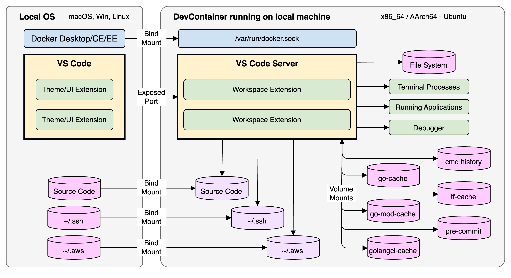

## Prerequisites

1. Linux, macOS, or Windows machine running [Visual Studio Code](https://code.visualstudio.com/) v1.90.0+ or [Cursor AI Code Editor](https://www.cursor.com/) v0.50.3 or newer.
2. [Docker Desktop](https://www.docker.com/products/docker-desktop/) v4.30.0 or newer. `Podman` and `Finch` are currently not supported for `devcontainer` usage.
3. [Dev Containers Extension](vscode:extension/ms-vscode-remote.remote-containers) v0.369.0 or newer.
4. (Optional) [Remote - SSH Extension](vscode:extension/ms-vscode-remote.remote-ssh) v0.112.0 or newer. (alternatively, the [Remote Development](vscode:extension/ms-vscode-remote.vscode-remote-extensionpack) extension pack v0.25.0 includes Dev Containers & Remote - SSH).

## Quick Install

* Install all prerequisites. Ensure the [Dev Containers Extension](vscode:extension/ms-vscode-remote.remote-containers) is installed in your VS Code on your host machine.

* Start [Docker Desktop](https://www.docker.com/products/docker-desktop/) on your host machine.

* `git clone` the [knfsd-file-cache](https://github.com/awslabs/knfsd-file-cache) repository to a local directory on your host machine.

* Start VS Code and click "File -> Open Workspace from File..." (navigate to the root of your cloned git repo): `knfsd-dev.code-workspace`

  > WARNING: Docker is about to generate a ~multiple GB image + volumes. Build time: ~10 minutes.

* Click the BLUE "Reopen in Container" button ("Clone in Volume" is not supported). Choose `dev` in the drop-down list.

  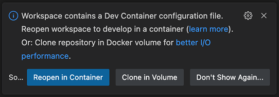

* Click the BLUE "(show log)" text to view the progress of the container build.

  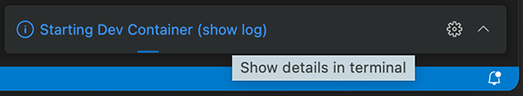

### Devcontainer: Considerations

* The devcontainer uses `ubuntu` as the default, non-root user. Typical devcontainer start-up time once fully cached is ~20 secs. The previous VSC session, including currently opened files and UI state should be reinstated upon devcontainer startup.

* There are considerable container image and 'cache' volume sizes (~15GB total) to be aware of in this setup:

  * `Dockerfile`: ~multiple GB
  * `Ubuntu`: ~98MB
  * `Bats`: ~105MB
  * `Postgres`: ~261MB
  * `knfsd-go-cache` volume: ~multiple GB
  * `knfsd-go-mod-cache` volume: ~multiple GB
  * `vscode` volume: ~266MB

* The `knfsd-dev.code-workspace` is respected independently of the devcontainer setup, with minimal `golang` configuration. We are using a multi-root workspace, so all roots/folders will be opened in the same .devcontainer, regardless of whether there are configuration files at lower levels in this project. This is a known devcontainer limitation and explains why we provide only a single "monorepo" .devcontainer configuration at the root.

* All versions of software installed in the `Dockerfile` are pinned to match the identical version being used in the `.gitlab-ci.yml` file.

* To override the default architecture (amd64/x86_64), set on your local OS the following 2 environment variables to the architecture you wish to build the devcontainer.

  ```bash
  export BUILDPLATFORM=linux/arm64 # linux/amd64 (default) or linux/arm64
  export BUILDARCH=arm64 # amd64 (default) or arm64
  ```

* If you modify any of the `.devcontainer/dev/` files, you will need to `rebuild` the container. The `Dockerfile` has already been written to minimise the impact of rebuild times via Docker layers that are cached.

  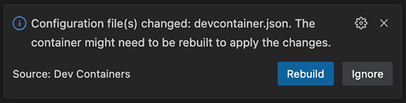

* Devcontainer commands such as: `Rebuild Container`, `Reopen Folder Locally`, and `Close Remote Connection` can be easily accessed via the GREEN *Remote Host* menu, in the bottom-left corner of the VS Code: Status Bar. If your Status Bar isn't GREEN, you have missed the prerequisite step to install the [Dev Containers Extension](vscode:extension/ms-vscode-remote.remote-containers) on your host machine. A restart of VS Code might be required.

  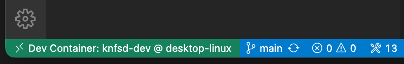

* To shutdown the devcontainer, you can `Close Remote Connection` or simply quit (cmd+q) the VS Code application.

* For more information on devcontainers, see the [Advanced container configuration](https://code.visualstudio.com/remote/advancedcontainers/overview) docs. Dev Containers have [known limitations](https://code.visualstudio.com/docs/devcontainers/containers#_known-limitations).

### Devcontainer: API Throttling

Regardless of where you clone the [knfsd-file-cache](https://github.com/awslabs/knfsd-file-cache) repository locally on your host machine; to avoid API throttling from GitHub whenever we pull golang 3rd party packages or use Packer, enter your GitHub **classic** [Personal Access Token](https://docs.github.com/en/authentication/keeping-your-account-and-data-secure/managing-your-personal-access-tokens#creating-a-personal-access-token-classic) for the following environment variables into your `/etc/environment` file in your devcontainer. Open the file (`sudo` required) and insert your [PAT](https://docs.github.com/en/authentication/keeping-your-account-and-data-secure/managing-your-personal-access-tokens#creating-a-personal-access-token-classic) `ghp_*` for both variables. The [Post-Build](#post-build) `validate-setup.sh` script can be used to validate your devcontainer setup. Ensure you close/re-open VS Code or `source /etc/environment` each terminal to receive the updated environment variables. Alternatively, the devcontainer will attempt to use these ENV VARs if already present in your local OS environment.

  ```bash
  $ sudo vim /etc/environment
  GITHUB_COM_TOKEN=<GITHUB-CLASSIC-PAT>
  PACKER_GITHUB_API_TOKEN=<GITHUB-CLASSIC-PAT>
  ```

### Devcontainer: Mounts/Volumes

The `workspaceMount`/`workspaceFolder` have been configured to: `/knfsd-file-cache`; the git repo's root directory on the Ubuntu container.

The devcontainer extension provides out of the box support for using local `git` credentials from inside a container by automatically copying your local `.gitconfig` file into the container on startup, so you should not need to do this in the container itself. See [Sharing Git credentials with your container](https://code.visualstudio.com/remote/advancedcontainers/sharing-git-credentials) for more information.

The devcontainer extension has been configured via: `"dev.containers.cacheVolume"=true` to cache the VS Code server and third-party extensions in a Docker volume: `vscode`.

The `devcontainer.json` file has a number of custom mounts configured (see breakdown below). `volume` mounts are prefixed with: `knfsd-dev-` to ensure no conflict with any existing Docker volumes on the host system. To support different host OS, we use the technique of only one environment variable resolving on a particular OS. So, `source=${localEnv:HOME}${localEnv:USERPROFILE}` will either resolve to: `~` (`$HOME`) on macOS/Linux or to the user's folder: `%USERPROFILE%` on Windows.

```bash
    # Docker persistent volume: Terraform cache: $HOME/.terraform.d/plugin-cache
    "source=knfsd-dev-tf-cache,target=/home/ubuntu/.terraform.d/plugin-cache,type=volume",

    # Docker persistent volume: go-build cache: $ go env GOCACHE ('/home/ubuntu/.cache/gobuild')
    "source=knfsd-dev-go-cache,target=/home/ubuntu/.cache/go-build,type=volume",

    # Docker persistent volume: go pkg mod cache: $ go env GOMODCACHE ('/home/ubuntu/go/pkg/mod')
    "source=knfsd-dev-go-mod-cache,target=/home/ubuntu/go/pkg/mod,type=volume",

    # Docker persistent volume: $GOLANGCI_LINT_CACHE ('/home/ubuntu/.cache/golangci-lint')
    "source=knfsd-dev-golangci-lint-cache,target=/home/ubuntu/.cache/golangci-lint,type=volume",

    # Docker persistent volume: pre-commit cache: $HOME/.cache/pre-commit
    "source=knfsd-dev-pre-commit-cache,target=/home/ubuntu/.cache/pre-commit,type=volume",

    # Docker persistent volume: saves all terminal/shell history from container for future use
    "source=knfsd-dev-commandhistory,target=/home/ubuntu/.commandhistory,type=volume",

    # Docker bind mount: pass host docker.sock through to container docker.sock for Docker-from-Docker
    # "//var..." allows Windows host support
    "source=//var/run/docker.sock,target=/var/run/docker.sock,type=bind",

    # Docker bind mount: pass user's ~/.ssh directory through to container user's ~/.ssh directory
    "source=${localEnv:HOME}${localEnv:USERPROFILE}/.ssh,target=/home/ubuntu/.ssh,type=bind",

    # Docker bind mount: pass user's ~/.aws creds/config through to container user's ~/.aws
    "source=${localEnv:HOME}${localEnv:USERPROFILE}/.aws,target=/home/ubuntu/.aws,type=bind"
```

### Devcontainer: Terminals

The `knfsd-dev.code-workspace` file contains `tasks` that automatically create a number of additional terminals upon startup; a terminal per `golang` project for faster navigation.

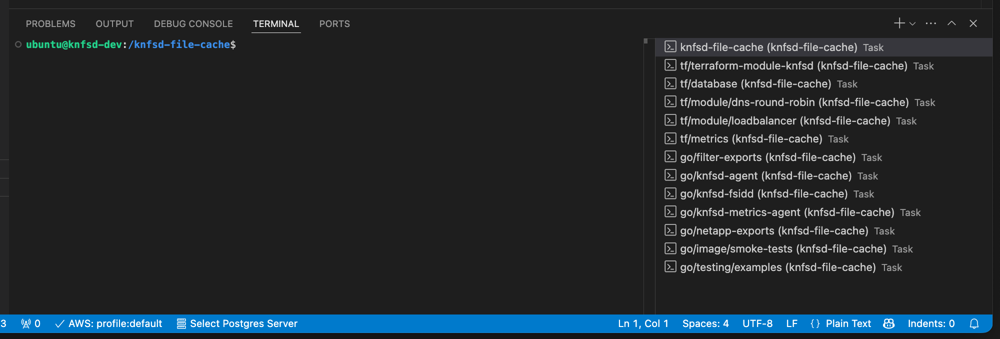

### Devcontainer: Docker-from-Docker

In this project we sometimes run a Docker container from within this devcontainer environment for testing certain areas of code. We avoid using Docker-in-Docker (D-in-D) and instead use [Docker-from-Docker](https://code.visualstudio.com/remote/advancedcontainers/use-docker-kubernetes) (also known as Docker-outside-Docker) for these limited situations. We also use Docker "host" networking only throughout this project via `.devcontainer.json` configuration.

This means:

* No need for elevated `--privileged` mode on the parent container and subsequent nested containers.
* No need to run container(s) as `root`.
* No need to access any host-based cache via D-in-D, as we create standalone caches as Docker volumes.
* No additional complexity with `cgroups` or `/var/lib/docker` with D-in-D configurations.
* Better visibility on host machine's Docker Desktop GUI of any nested containers/images/volumes.
* We pass the following environment variables to allow `bind` mounts in a nested container:
  * `"HOST_REPO_PATH": "${localWorkspaceFolder}"` in `devcontainer.json`.
  * `CI=devcontainer` in `Dockerfile`.
* At startup, we `chown` the devcontainer's `/var/run/docker.sock` to the current `remoteUser` which is `ubuntu`.

### Post-Build

* The `validate-setup.sh` script can be used to validate your devcontainer setup.

```bash
cd /knfsd-file-cache/.devcontainer/dev
./validate-setup.sh # execution time: <1 sec
```

All `✓` means success! `✗` is an error (RED) or warning (YELLOW). `-` means info (BLUE).

```bash
✓ curl found
✓ dpkg found
✓ gcc found
✓ git found
...
✗ GITHUB_COM_TOKEN is not set
✗ PACKER_GITHUB_API_TOKEN is not set
✓ HOME is set to: /home/ubuntu
- Not running on EC2. IMDSv2 check skipped
```

* The `go-mod-download.sh` script will hydrate the Docker `knfsd-dev-go-mod-cache` volume (`$ go env GOMODCACHE`) with all required `golang` packages for all the go projects. Ideally, you should execute this script whilst connected to a fast internet link. Ensure your devcontainer has the `GITHUB_COM_TOKEN` environment variable configured.

```bash
env | grep GITHUB_COM_TOKEN
cd /knfsd-file-cache/.devcontainer/dev
./go-mod-download.sh # execution time: ~15 minutes
```

When everything is cached, the script should take <1s to execute and `stdout` should look like this:

```bash
caching.../knfsd-file-cache/image/resources/knfsd-fsidd
retry_command: go mod tidy
retry_command: go mod download
...
caching.../knfsd-file-cache/image/smoke-tests
retry_command: go mod tidy
retry_command: go mod download
caching.../knfsd-file-cache/testing/examples
retry_command: go mod tidy
retry_command: go mod download
```

### House Cleaning

Depending on usage, some house cleaning on a regular basis is recommended to minimise your storage footprint.

* *Docker Desktop Dashboard* -> *Volumes*, ensure you monitor the `knfsd-dev-go-cache` and `knfsd-dev-go-mod-cache` volume size growth. Although not a requirement for the devcontainer to operate, if you are logged into your Docker user account in *Docker Desktop*, then you can click on a specific volume and `Empty volume` to purge it. Note this will force a rebuild of your existing devcontainer. Alternatively (and not requiring a Docker user account login), the volume sizes can be queried and purged via the CLI within the devcontainer and not force a rebuild.

  ```bash
  du -sh $(go env GOCACHE)
  go clean -cache

  du -sh $(go env GOMODCACHE)
  go clean -modcache
  ```

* *Docker CLI*, Docker caches can build up over time. These commands should be used carefully to reduce used disk space on the host machine.

  ```bash
  docker builder prune
  docker system prune
  ```

### Additional Notes

* Occasionally you may encounter a transient error or cache/extensions error during the build/rebuild process. Use the *Docker Desktop* -> *Builds* -> *Build history* logs to identify any errors in the build. Try clicking on `Retry` in *VS Code* to resolve the issue or click the `Clean / Purge data` button via the [Troubleshoot](https://docs.docker.com/desktop/troubleshoot/overview/) page in *Docker Desktop*.

  > WARNING: `Clean / Purge data` will delete all Docker volumes including the `GOCACHE/GOMODCACHE`.

* In VS Code, press `F1` or `Shift+Cmd+P` to access the `Command Palette` and type: >`devcon` to see all possible commands, such as: `Dev Containers: Rebuild Container Without Cache`, which will force a full rebuild of the devcontainer, ignoring any Docker cached layers.

* To remove the Docker "hints and tips" stdout messages whenever you use a `docker` CLI command, uncheck the `Show CLI hints` checkbox in *Docker Desktop* -> *Settings* -> *General*. Click `Apply & restart` (ensure devcontainers can be restarted) before restarting Docker Desktop.

## Remote-SSH (Cloud Development Environment)

The [Remote - SSH](vscode:extension/ms-vscode-remote.remote-ssh) VS Code extension allows us to transport the [devcontainer](https://code.visualstudio.com/docs/devcontainers/containers) integrated development environment (IDE) for this project and host it on an AWS EC2 instance and access it securely over SSH from a location of your choice/control. This is known as a cloud development environment (CDE). We provide 2 possible setups. By default (`./remote.sh new vm`), we launch and build the CDE natively running on the EC2 host. Alternatively, we can launch (`./remote.sh new docker`) an optimized version on EC2 host with the devcontainer setup as per on-premises. Both setups provides a number of [benefits](https://code.visualstudio.com/docs/remote/remote-overview) for this project, including the ability to use larger (storage/network), faster or different architecture (x86, arm64) EC2 instances with access to [IMDS](https://docs.aws.amazon.com/AWSEC2/latest/UserGuide/ec2-instance-metadata.html). The default `VM` setup most closely replicates a production file-caching environment as it runs the custom knfsd kernel with various patches, NFS server/client and FS-Cache kernel modules. Both setups can run Docker on the EC2 host.

Bind mounts are not possible over SSH, so we localize the source-code (`git clone` or `rsync` transfer from local git repo) and optional, AWS credentials. We run Docker locally on the EC2 host. We use our local SSH forwarding-agent for SSH access to the EC2 host. The `devcontainer.json` & `Dockerfile` do not require any changes and thus can be reused in this new cloud development environment.

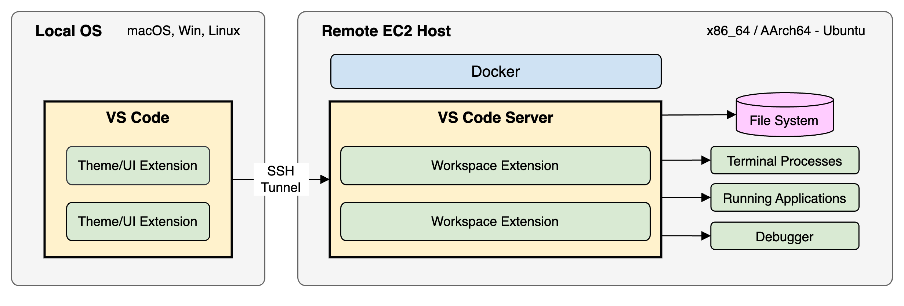

## Additional Prerequisites

1. AWS account with applicable IAM permissions.
2. A supported [OpenSSH compatible SSH client](https://code.visualstudio.com/docs/remote/troubleshooting#_installing-a-supported-ssh-client) must be installed (macOS is pre-installed).
3. [Remote - SSH Extension](vscode:extension/ms-vscode-remote.remote-ssh) v0.112.0 or newer (alternatively, the [Remote Development](vscode:extension/ms-vscode-remote.vscode-remote-extensionpack) extension pack v0.25.0 includes Dev Containers & Remote - SSH).
4. In VS Code, press `F1` or `Shift+Cmd+P` to access the `Command Palette` and type: >`Preferences: Open User Settings (JSON)` and add the following to your local VS Code user `settings.json` file:

  ```json
  {
    "remote.SSH.defaultExtensions": [
      "DavidAnson.vscode-markdownlint",
      "EditorConfig.EditorConfig",
      "SirTori.indenticator",
      "Tyriar.sort-lines",
      "amazonwebservices.aws-toolkit-vscode",
      "ckolkman.vscode-postgres",
      "coolbear.systemd-unit-file",
      "dannysteenman.cloudformation-yaml-snippets",
      "donjayamanne.githistory",
      "golang.go",
      "hashicorp.terraform",
      "jetmartin.bats",
      "jianbingfang.dupchecker",
      "mkhl.shfmt",
      "ms-azuretools.vscode-docker",
      "oderwat.indent-rainbow",
      "redhat.vscode-yaml",
      "tfsec.tfsec",
      "hashicorp.hcl"
    ]
  }
  ```

### Remote-SSH: Considerations

It is beyond the scope of this documentation to describe all possible SSH setups that can work here and are compliant to your security policies. For further reading, please consult the AWS public docs on how you can [connect to your Linux instance](https://docs.aws.amazon.com/AWSEC2/latest/UserGuide/connect-to-linux-instance.html). This documentation provides an opinionated SSH setup via provisioning an [Amazon EC2 Instance Connect (EIC) Endpoint](https://docs.aws.amazon.com/AWSEC2/latest/UserGuide/connect-with-ec2-instance-connect-endpoint.html) (free), which means:

* Connect securely to your EC2 instance in a **private** subnet, with no public IP address.
* No IGW/NAT Gateway required in your VPC (although if you wish to download installable components which is part of the devcontainer build process, you should provision a IGW/NAT or use an offline solution for your needs).
* No agent required, simply use the OpenSSH `ProxyCommand` within your existing local SSH configuration.
* Security posture is raised via using SSH within a secure, identity-aware TCP tunnel with your AWS IAM credentials.
* All authentication and authorization is evaluated before traffic reaches your VPC.
* This routable traffic solution can work over public internet, VPN or DX to suit all customer needs.
* The EIC endpoint has a maximum tunnel duration of 1 hour per SSH session. Simply re-connect to host to continue (UI state is restored).
* [Further considerations](https://docs.aws.amazon.com/AWSEC2/latest/UserGuide/connect-with-ec2-instance-connect-endpoint.html#ec2-instance-connect-endpoint-prerequisites) and EIC [Quotas](https://docs.aws.amazon.com/AWSEC2/latest/UserGuide/eice-quotas.html).

### Remote-SSH: EC2 Instance Connect (EIC) Endpoint

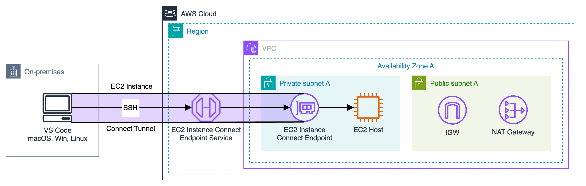

This [blog post](https://aws.amazon.com/blogs/compute/secure-connectivity-from-public-to-private-introducing-ec2-instance-connect-endpoint-june-13-2023/) provides a good overview of how to provision and configure an EIC Endpoint, together with the official [AWS documentation](https://docs.aws.amazon.com/AWSEC2/latest/UserGuide/create-ec2-instance-connect-endpoints.html). Here is a summary of the steps:

* Create/access your AWS account.
* Choose which AWS region you are going to use.
* Create/import a [key pair](https://docs.aws.amazon.com/AWSEC2/latest/UserGuide/ec2-key-pairs.html). We assume a 2048-bit SSH-2 RSA key is used.
* Create VPC or use default VPC, add private subnet, add IGW, add [NAT Gateway](https://docs.aws.amazon.com/vpc/latest/userguide/nat-gateway-scenarios.html#public-nat-internet-access), add routing table with subnet association to the private subnet and IGW/NAT (in public subnet) for public internet access (optional).
* IAM user with correct [permissions](https://docs.aws.amazon.com/AWSEC2/latest/UserGuide/permissions-for-ec2-instance-connect-endpoint.html) to create EIC endpoint.
* [Security Group(s)](https://docs.aws.amazon.com/AWSEC2/latest/UserGuide/eice-security-groups.html) for EIC Endpoint (optional, the default is to use the default security group for the VPC) and/or EC2 instance.
* [Create EIC Endpoint](https://docs.aws.amazon.com/AWSEC2/latest/UserGuide/create-ec2-instance-connect-endpoints.html). Ensure you provision the endpoint in the same subnet that you intend to launch your EC2 instance to avoid any cross-AZ data transfer cost.

  ```bash
  aws ec2 create-instance-connect-endpoint --subnet-id <subnet-id>
  ```

* IAM user with correct permissions to create, delete, start, stop an EC2 instance in the private subnet.
* Create EC2 instance in private subnet. See next section on the `remote.sh` wrapper script to handle workflow commands automatically.
* Confirm EIC tunnel and ssh working correctly via [AWS CLI](https://docs.aws.amazon.com/AWSEC2/latest/UserGuide/connect-using-eice.html).

  ```bash
  aws ec2-instance-connect ssh --instance-id <instance-id> --connection-type eice
  ```

### Remote-SSH: Remote Wrapper Script

To ensure a reliable workflow of provision, start, SSH config, stop, and terminate EC2 instance host, as well as various convenience functions, a shell script has been created in `.devcontainer/dev/remote.sh`.

3 environment variables are required to be present for the successful provisioning of an EC2 instance:

  ```bash
  export KNFSD_REMOTE_SSH_KEYPAIR=<keypair-name> # "name" of the RSA key created/uploaded to your AWS account
  export KNFSD_REMOTE_SSH_SUBNET=<subnet-id> # "id" of the private subnet where the EC2 instance will be launched
  export KNFSD_REMOTE_SSH_SG_ID=<security-group-id> # "id" of the security group to be used for the EC2 instance
  ```

Usage of the shell script can be viewed via: `.devcontainer/dev/remote.sh -h|help|--help`.

  ```bash
  Ensure AWS credentials/region are configured.

  Commands:
      ./remote.sh help|-h|--help
          Show this message
      ./remote.sh
          Start the EC2 instance and add ssh-config (default)
      ./remote.sh create|new [<vm|docker>] [<amd64|arm64>]
          Create a new EC2 VM (default) instance. Required ENV VARs:
          KNFSD_REMOTE_SSH_KEYPAIR
              The name of the EC2 keypair
          KNFSD_REMOTE_SSH_SUBNET
              The ID of the EC2 subnet
          KNFSD_REMOTE_SSH_SG_ID
              The ID of the EC2 security group
          [<vm|docker>] vm (default) or docker (devcontainer) on EC2 host [optional]
          [<amd64|arm64>] amd64 (default) or arm64 on EC2 host [optional]
          ENV VAR: BUILDARCH=<amd64|arm64> also sets the architecture for the EC2 host [optional]
      ./remote.sh up|start
          Start the EC2 instance and add ssh-config
      ./remote.sh down|stop
          Stop the EC2 instance
      ./remote.sh size <INSTANCE_TYPE>
          Modify the instance type of the EC2 instance
      ./remote.sh sync <push|pull> [<test>]
          <push> code changes from local <devcontainer> to <remote-ssh>
          <pull> code changes from <remote-ssh> to local <devcontainer>
          <test> run dry-run only [optional]
          .git directory is ignored
      ./remote.sh creds
          Copy local AWS config/creds to <remote-ssh>
      ./remote.sh delete|del|terminate
          Delete the EC2 instance and remove ssh-config
  ```

### Remote-SSH: VM Setup

The first 3 steps can be skipped if you already have a running devcontainer locally, as per the previous instructions above.

* *Local*: `git clone` the [knfsd-file-cache](https://github.com/awslabs/knfsd-file-cache) repository to a local directory on your host machine (you should already have done this as part of the local .devcontainer/dev setup).
* *Local*: Start VS Code and click "File -> Open Workspace from File..." (navigate to the root of your cloned git repo): `knfsd-dev.code-workspace`
* *Local*: Re-open as a devcontainer.
* *Local*: In a terminal, `cd /knfsd-file-cache/.devcontainer/dev`
* *Local*: Execute `aws configure`, enter your AWS credentials and AWS region (bind mounted already from your local host machine).

  ```bash
  AWS Access Key ID [****************ABCD]:
  AWS Secret Access Key [****************ABCD]:
  Default region name [eu-west-2]:
  Default output format [json]:
  ```

* *Local*: Ensure 3 environment variables are present in your terminal for the EC2 instance to be launched:

  ```bash
  export KNFSD_REMOTE_SSH_KEYPAIR=<keypair-name>
  export KNFSD_REMOTE_SSH_SUBNET=<subnet-id>
  export KNFSD_REMOTE_SSH_SG_ID=<security-group-id>
  ```

* *Local*: Execute `./remote.sh new vm` will provision a new EC2 instance (default: c5n.large, amd64, 30GB EBS root) and automatically configure your local SSH config (`~/.ssh/config`) file. The EC2 host will be configured via the `setup-remote-vm.sh` user-data script at launch.

  ```bash
  INFO: knfsd-dev-ec2: i-1234567890abcdef0 created as: EC2 VM
  INFO: ssh config file: /home/ubuntu/.ssh/config
  INFO: ssh config added: knfsd-dev-ec2
  ```

* *Local*: Wait until the EC2 instance is displaying a [status check](https://docs.aws.amazon.com/AWSEC2/latest/UserGuide/monitoring-system-instance-status-check.html) of **3/3 checks passed** in the EC2 Console. Typically, the `setup-remote-vm.sh` script takes 3-4 mins to execute (depending on the specific EC2 instance type used). Inspect the "Launch time" property in EC2 Console to monitor time since launch.
* *Local*: Press `F1` or `Shift+Cmd+P` to access the `Command Palette` and start typing: >`Remote-SSH: Open SSH Configuration File...` -> select your SSH config file, such as: `~/.ssh/config`. In VS Code you can manually verify the newly create `Host knfsd-dev-ec2` entry that should look similar to below:

  ```bash
  Host knfsd-dev-ec2
    User ubuntu
    HostName i-1234567890abcdef0
    IdentityFile ~/.ssh/id_rsa
    StrictHostKeyChecking no
    ForwardAgent yes
    IdentitiesOnly yes
    ProxyCommand bash -c "aws ec2-instance-connect open-tunnel --instance-id %h"
  ```

* *Local*: Press `F1` or `Shift+Cmd+P` to access the `Command Palette` and start typing: >`Remote-SSH: Connect to Host...`. Alternatively, click on GREEN status-bar in bottom left-hand corner of VS Code and select: `Connect to Host...` in the drop-down list.
* *Local*: Select `knfsd-dev-ec2` to open a new VS Code window and SSH connection to your EC2 host.
* *Remote*: Click *Open Folder* BLUE button or *File* -> *Open* -> `/knfsd-file-cache`. This directory will be empty.

  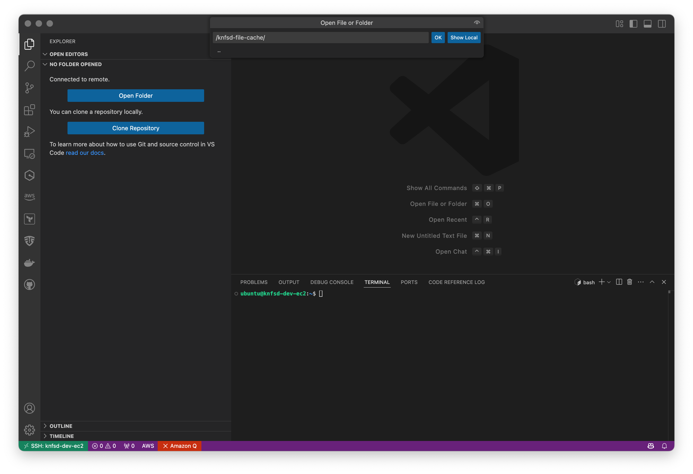

* *Remote*: If you have access to your git server, then using a terminal: `git clone <git-repo-path>/ .` into `/knfsd-file-cache`.
* *Local*: Alternatively, on your local machine, using a terminal: `./remote.sh sync push` to rsync your local `/knfsd-file-cache` git repo to your remote-ssh host (excluding `.git` directory).
* *Remote*: Open the `knfsd-dev.code-workspace` file in VS Code (click on the BLUE `Open Workspace` button). Ignore the pop-up dialog offering to "Reopen in Container". Click X to close pop-up dialog.

  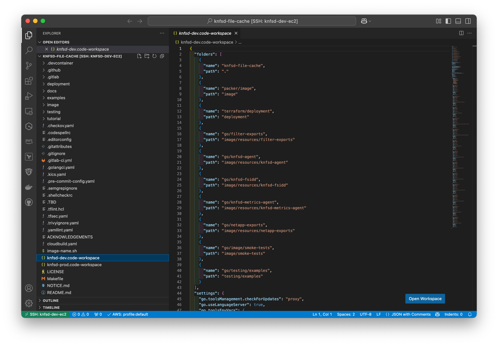

* *Remote*: VS Code will look identical to your local devcontainer setup. The GREEN status bar should display: `SSH: knfsd-dev-ec2`, where `knfsd-dev-ec2` is the EC2 instance hostname.
* *Local*: (optional) Execute `./remote.sh creds` to rsync your local (bind mounted) `~/.aws` credentials to your remote-ssh machine.
* *Remote*: (recommended) The pre-existing `validate-setup.sh` (validates IMDSv2 is working correctly) and `go-mod-download.sh` shell scripts will work identically to your local devcontainer setup.

  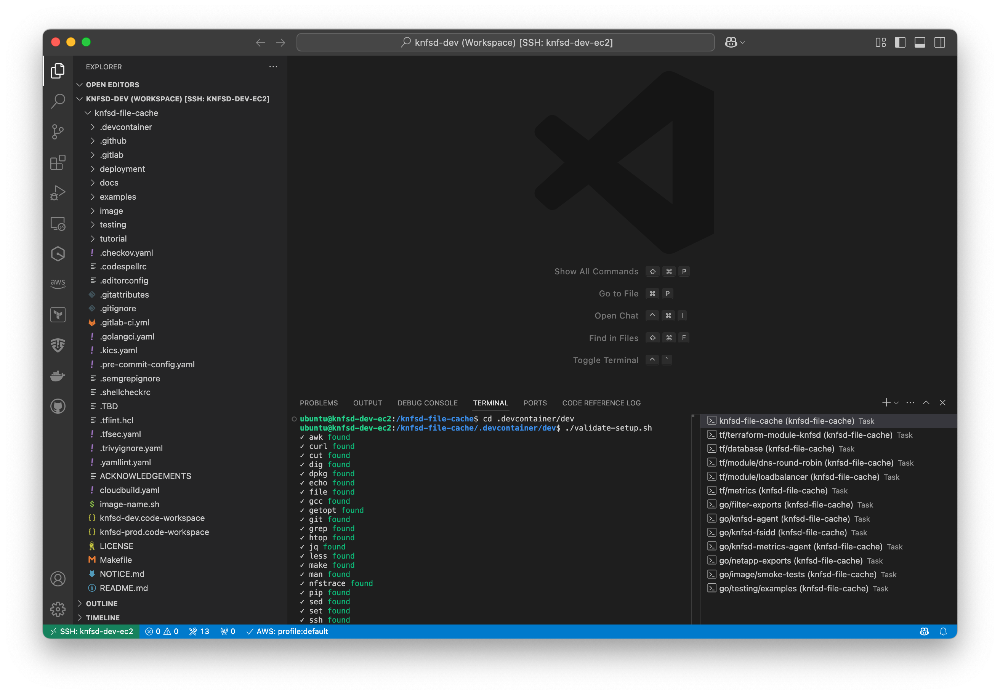

### Remote-SSH: DevContainer Setup

As an alternative (optional) setup, you can run the devcontainer environment on the EC2 host.

  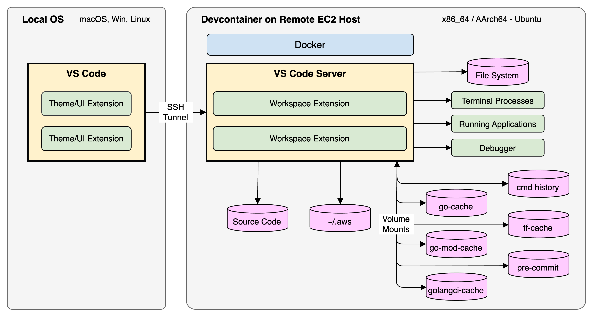

* *Local*: Follow all the previous steps. For optimal, minimal setup, use this alternative command option when creating the EC2 host: `./remote.sh new docker`
* *Remote*: Click GREEN `SSH: knfsd-dev-ec2` bottom-left corner, status-bar and select in drop-down list: "Reopen in Container". Choose `dev` in the drop-down list.
* *Remote*: The devcontainer will now be built from the `Dockerfile`.

  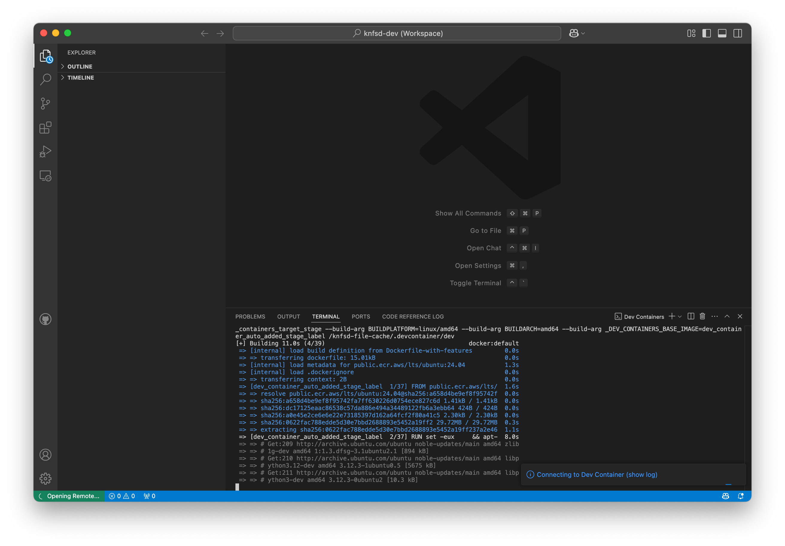

* *Remote*: At completion, VS Code will look identical to your local devcontainer setup. The GREEN status bar should display: `Dev Container: knfsd-dev @ knfsd-dev-ec2`, where `knfsd-dev` is the devcontainer image name and `knfsd-dev-ec2` is the EC2 instance hostname.

  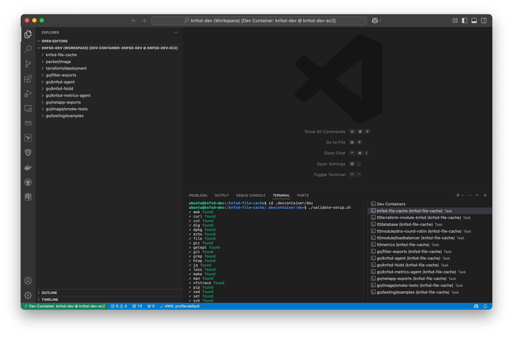

### Remote-SSH: General Usage

Once *Initial Setup* is completed above, general usage of your cloud development environment is simply:

* *Local*: Execute `./remote.sh up` or `./remote.sh down` to start or stop your host.
* *Local*: Execute `./remote.sh sync <push|pull>` to rsync *PUSH* (to Remote-SSH host) or rsync *PULL* (from Remote-SSH host) any source-code changes (as .git remains on your local machine only for source control). The (optional) `<test>` argument allows you to list what dirs/files will be synced as a dry-run (no action).
* The EC2 IC Endpoint has a [maximum tunnel duration](https://docs.aws.amazon.com/AWSEC2/latest/UserGuide/connect-with-ec2-instance-connect-endpoint.html#ec2-instance-connect-endpoint-prerequisites) for an established TCP connection of 1 hour (3,600 seconds) by default. Upon disconnection in your *Remote-SSH* window, simply click on the GREEN status-bar once and select: `Reopen Folder in SSH`. Additionally if using devcontainer, then select: `Reopen in Container`. All your currently opened files and UI state in VS Code will be reinstated.

### Remote-SSH: Cleanup

* *Local*: Execute `./remote.sh del` to delete (terminate) your EC2 instance when you won't need the instance for an extended period of time. Note: you will need to complete the *Initial Setup* again.

  ```bash
  INFO: knfsd-dev-ec2: i-1234567890abcdef0 deleted
  INFO: ssh config file: /home/ubuntu/.ssh/config
  INFO: ssh config deleted: knfsd-dev-ec2
  ```

* *Local*: EIC Endpoint can be deleted when no longer required. See [AWS documentation](https://docs.aws.amazon.com/AWSEC2/latest/UserGuide/delete-ec2-instance-connect-endpoint.html).

### Remote-SSH: Troubleshooting

* Do NOT edit the AWS TAG `Name=knfsd-dev-ec2` as this is how the `remote.sh` wrapper script tracks which EC2 instance to control.
* Although you can use any other API entry point, including the *EC2 Console* to start/stop/terminate your EC2 instance, it is recommended to use the `remote.sh` wrapper script as it cleans up your SSH config.
* Ensure your SSH key has been added to your local ssh-agent on macOS.

  ```bash
  ssh-add -l # should list fingerprints of all identities currently represented by the ssh-agent
  ssh-add -K # to add default identities from local OS
  ssh-agent # should list the current SSH_AUTH_SOCK and SSH_AGENT_PID
  ```

* The following (optional) global SSH options may prove useful in your SSH config file on macOS. Please consult your macOS SSH man page to understand these options.

  ```bash
  Host *
    AddKeysToAgent yes
    IgnoreUnknown UseKeychain
    UseKeychain yes
    ServerAliveInterval 30
    ServerAliveCountMax  5
    PubkeyAcceptedAlgorithms +ssh-rsa-cert-v01@openssh.com
  ```

* Post *Initial Setup*, you may wish to modify the spec of EC2 instance type (c5n.large ~$0.10/hr OD in us-east-1) when it is **stopped**. The `./remote.sh` script can be used.

  ```bash
  ./remote.sh size <INSTANCE_TYPE>
  ```

* The `./remote.sh` script can be used to provision an EC2 host with a different architecture.

  ```bash
  ./remote.sh new <vm|docker> <amd64|arm64>
  ```
