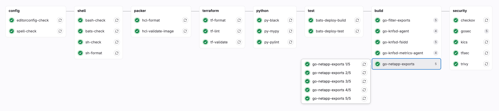
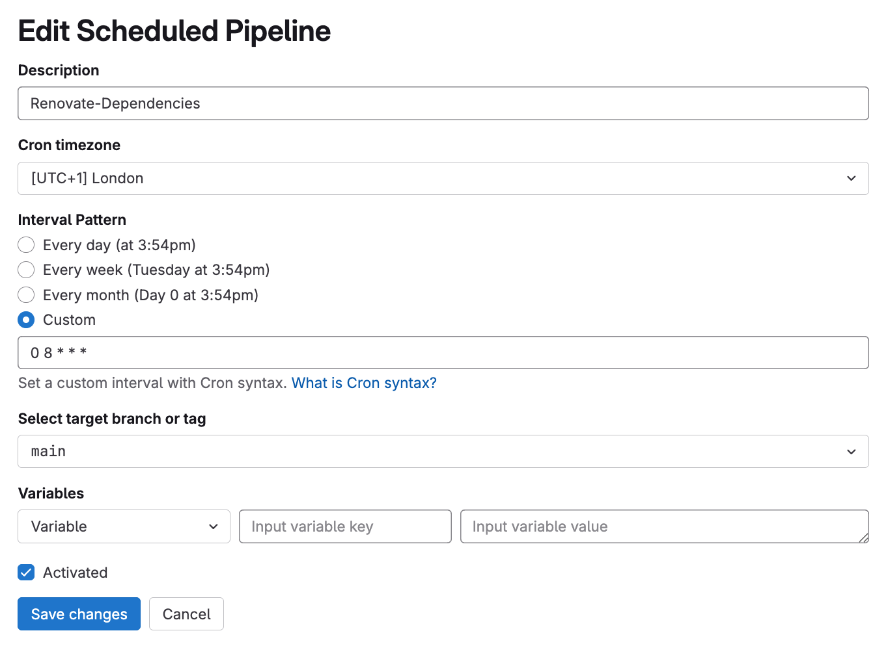
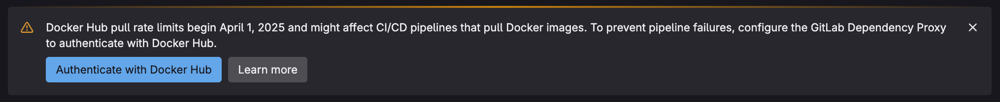

# GitLab CI Pipeline

> NOTE: You do not need to follow these instructions to create the image & deploy the knfsd-file-cache solution on AWS.

A `.gitlab-ci-aws.yml` file is provided in the root of this repository to enable automated, continuous integration of the KNFSD File Cache solution on AWS. This pipeline implements industry best practices for code quality, security scanning, and multi-architecture builds.

This pipeline is designed to run on a self-hosted GitLab deployment. It should be used in conjunction with the `pre-commit` system to ensure that the code is properly formatted and linted before being committed to the repository.



## Pipeline Overview

The GitLab CI pipeline is structured into 8(+1 scheduled) distinct stages that execute sequentially, with jobs within each stage running in parallel where possible:

1. **dependencies** - Dependency management and automated updates (scheduled)
2. **config** - Editorconfig, spell-check, and formatting
3. **shell** - Shell script linting and formatting
4. **packer** - Packer configuration validation
5. **terraform** - Terraform configuration validation and linting
6. **python** - Python code quality checks
7. **test** - Integration testing
8. **build** - Go application lint, test, cross-platform build, and vulnerability scanning
9. **security** - Security scanning and vulnerability assessment

## Configuration

To enable this pipeline, you should:

1. Copy the `.gitlab-ci-aws.yml` file and rename it to `.gitlab-ci.yml` (already added to the `.gitignore` file)
2. Create a GitLab Personal Access Token named `RENOVATE_TOKEN` with the following scopes:

    ```shell
    api,read_api,read_user,self_rotate,read_repository,write_repository,read_registry
    ```

3. Create a GitLab `environment` named `renovate`.
4. Add the following variables to `Settings > CI/CD > Variables` in your GitLab project:

    | Variable Name (Key)         | Environment   | Visibility | Expanded | Description                                                                                                                                   |
    |-----------------------------|---------------|------------|----------|-----------------------------------------------------------------------------------------------------------------------------------------------|
    | `PACKER_GITHUB_API_TOKEN`   | All (default) | Masked     | Yes      | A GitHub PAT (personal access token) to reduce throttling from GitHub API (can be same value as `RENOVATE_GITHUB_COM_TOKEN`).                 |
    | `RENOVATE_GITHUB_COM_TOKEN` | `renovate`    | Masked     | Yes      | A GitHub PAT (personal access token) to reduce throttling from GitHub API (can be same value as `PACKER_GITHUB_API_TOKEN`).                   |
    | `RENOVATE_TOKEN`            | `renovate`    | Masked     | Yes      | A GitLab PAT (personal access token) with access to the `knfsd-file-cache` repository. Insert the `RENOVATE_TOKEN` value from step 2 above.   |
    | `TERM`                      | All (default) | Visible    | Yes      | The terminal type to use for the pipeline. Set value to `ansi`.                                                                               |

    **URL Links:**

    - [Docker Hub Rate Limits](https://about.gitlab.com/blog/prepare-now-docker-hub-rate-limits-will-impact-gitlab-ci-cd/)
    - [GitHub PAT](https://docs.github.com/en/authentication/keeping-your-account-and-data-secure/managing-your-personal-access-tokens)
    - [GitLab PAT](https://docs.gitlab.com/ee/user/profile/personal_access_tokens.html)

5. Schedule the `renovate` job to run daily at 08:00 UTC+1 (or as needed) via `Build > Pipeline schedules` in your GitLab project.

    

## GitLab Runners

The provided `.gitlab-ci-aws.yml` file assumes the following shared GitLab Runner configuration is available:

| Arch    | Size      | vCPU | Memory |
|---------|-----------|------|--------|
| `amd64` | `medium`  | 2    | 8GB    |
| `amd64` | `xlarge`  | 8    | 32GB   |
| `amd64` | `2xlarge` | 16   | 64GB   |

Runner tags are in the format of `keyword:value`. Example of tagging:

```yaml
tags:
  - arch:amd64
  - size:xlarge
```

Gitlab runner compute specification and architecture used is dictated by tags in our `gitlab-ci-aws.yml` file. This should be modified to match your GitLab Runner configuration.

The most compute and/or network intensive CI jobs are configured with a `2xlarge` runner.

## Pipeline Stages and Jobs

### Dependencies Stage (scheduled)

#### `renovate-config-validator`

- **Purpose**: Validates Renovate configuration files
- **Reference**: [Renovate Configuration Validator](https://docs.renovatebot.com/config-validation/)
- **Failure Policy**: Blocking (pipeline fails if this job fails)

#### `renovate`

- **Purpose**: Automated dependency updates using Renovate
- **Schedule**: Runs only on scheduled pipelines
- **Reference**: [Renovate Bot Documentation](https://docs.renovatebot.com/)
- **Dependencies**: Requires `renovate-config-validator` to pass
- **Failure Policy**: Blocking

### Config Stage

#### `editorconfig-check`

- **Purpose**: Validates code formatting consistency using EditorConfig
- **Tool**: [editorconfig-checker](https://github.com/editorconfig-checker/editorconfig-checker)
- **Reference**: [GitLab CI EditorConfig](https://docs.gitlab.com/ee/development/contributing/style_guides.html)
- **Failure Policy**: Blocking

#### `spell-check`

- **Purpose**: Checks for spelling errors in documentation and comments
- **Tool**: [Codespell](https://github.com/codespell-project/codespell)
- **Configuration**: Uses `.codespellrc` configuration file
- **Failure Policy**: Blocking

### Shell Stage

#### `bash-check`, `bats-check`, `sh-check`

- **Purpose**: Static analysis of shell scripts for common issues
- **Tool**: [ShellCheck](https://github.com/koalaman/shellcheck)
- **Reference**: [ShellCheck Documentation](https://www.shellcheck.net/)
- **Scope**: Analyzes `.bash`, `.bats`, and `.sh` files respectively
- **Failure Policy**: Warning (allows pipeline to continue)

#### `sh-format`

- **Purpose**: Validates shell script formatting
- **Tool**: [shfmt](https://github.com/mvdan/sh)
- **Reference**: [shfmt Documentation](https://github.com/mvdan/sh/blob/master/cmd/shfmt/shfmt.1.scd)
- **Failure Policy**: Warning

### Packer Stage

#### `hcl-format`

- **Purpose**: Validates HCL file formatting for Packer configurations
- **Tool**: Packer built-in formatter
- **Reference**: [Packer fmt Command](https://developer.hashicorp.com/packer/docs/commands/fmt)
- **Failure Policy**: Blocking

#### `hcl-validate-image`

- **Purpose**: Validates Packer template syntax and configuration
- **Tool**: Packer built-in validator
- **Reference**: [Packer validate Command](https://developer.hashicorp.com/packer/docs/commands/validate)
- **Failure Policy**: Blocking

### Terraform Stage

#### `tf-format`

- **Purpose**: Validates Terraform file formatting
- **Tool**: Terraform built-in formatter
- **Reference**: [Terraform fmt Command](https://developer.hashicorp.com/terraform/cli/commands/fmt)
- **Failure Policy**: Blocking

#### `tf-lint`

- **Purpose**: Advanced Terraform linting and best practices validation
- **Tool**: [TFLint](https://github.com/terraform-linters/tflint)
- **Configuration**: Uses `.tflint.hcl` configuration file
- **Reference**: [TFLint Documentation](https://github.com/terraform-linters/tflint/blob/master/README.md)
- **Failure Policy**: Blocking

#### `tf-validate`

- **Purpose**: Validates Terraform configuration syntax across all modules
- **Tool**: Terraform built-in validator
- **Reference**: [Terraform validate Command](https://developer.hashicorp.com/terraform/cli/commands/validate)
- **Cache**: Uses Terraform plugin cache for performance
- **Failure Policy**: Blocking

### Python Stage

#### `py-black`

- **Purpose**: Python code formatting validation
- **Tool**: [Black](https://github.com/psf/black)
- **Target**: Python 3.14 compatibility
- **Reference**: [Black Documentation](https://black.readthedocs.io/)
- **Failure Policy**: Blocking

#### `py-mypy`

- **Purpose**: Static type checking for Python code
- **Tool**: [MyPy](https://github.com/python/mypy)
- **Reference**: [MyPy Documentation](https://mypy.readthedocs.io/)
- **Cache**: Uses MyPy cache for performance
- **Failure Policy**: Blocking

#### `py-pylint`

- **Purpose**: Python code quality and style analysis
- **Tool**: [Pylint](https://github.com/pylint-dev/pylint)
- **Reference**: [Pylint Documentation](https://pylint.pycqa.org/)
- **Failure Policy**: Blocking

### Test Stage

#### `bats-deploy-build`

- **Purpose**: Builds a Docker container for BATS (Bash Automated Testing System) tests
- **Tool**: [Kaniko](https://github.com/GoogleContainerTools/kaniko) for container builds
- **Registry**: Stores built image in GitLab Container Registry
- **Reference**: [GitLab Container Registry](https://docs.gitlab.com/ee/user/packages/container_registry/)
- **Failure Policy**: Blocking

#### `bats-deploy-test`

- **Purpose**: Executes deployment validation tests using BATS
- **Tool**: [BATS](https://bats-core.readthedocs.io/)
- **Dependencies**: Requires `bats-deploy-build` to complete
- **Reference**: [BATS Documentation](https://bats-core.readthedocs.io/en/stable/usage.html)
- **Failure Policy**: Blocking

### Build Stage

The build stage contains multiple Go application builds organized into sequential sub-jobs:

#### `go-filter-exports` (5 jobs)

1. **populate-cache**: Downloads and caches Go modules
2. **lint,format**: Code linting and formatting validation
3. **vulnerability scan**: Security vulnerability assessment
4. **test,vet,race,cover**: Comprehensive testing including race condition detection
5. **build**: Multi-architecture binary compilation (AMD64, ARM64)

#### `go-knfsd-agent` (4 jobs)

Similar structure to filter-exports but without vulnerability scanning step.

#### `go-knfsd-fsidd` (5 jobs)

Includes database integration testing with PostgreSQL service.

#### `go-knfsd-metrics-agent` (4 jobs)

Largest Go project requiring 2xlarge runners for performance.

#### `go-netapp-exports` (5 jobs)

Includes certificate generation for testing TLS functionality.

**Common Go Job Features:**

- **Linting**: [golangci-lint](https://golangci-lint.run/) with comprehensive rule set
- **Vulnerability Scanning**: [govulncheck](https://pkg.go.dev/golang.org/x/vuln/cmd/govulncheck)
- **Testing**: Race condition detection, code coverage, and static analysis
- **Multi-arch Builds**: Both AMD64 and ARM64 architectures
- **Caching**: Separate caches for modules, build artifacts, and lint results

### Security Stage

#### `checkov`

- **Purpose**: Infrastructure as Code security scanning
- **Tool**: [Checkov](https://www.checkov.io/)
- **Reference**: [Checkov Documentation](https://www.checkov.io/1.Welcome/Quick%20Start.html)
- **Configuration**: Uses `.checkov.yaml` configuration file
- **Failure Policy**: Warning

#### `gosec` (5 jobs)

- **Purpose**: Go source code security analysis
- **Tool**: [Gosec](https://github.com/securego/gosec)
- **Reference**: [Gosec Documentation](https://github.com/securego/gosec/blob/master/README.md)
- **Scope**: Analyzes each Go project independently
- **Failure Policy**: Warning

#### `kics`

- **Purpose**: Infrastructure security scanning
- **Tool**: [KICS](https://github.com/Checkmarx/kics)
- **Reference**: [KICS Documentation](https://docs.kics.io/)
- **Configuration**: Uses `.kics.yaml` configuration file
- **Failure Policy**: Warning

#### `trivy`

- **Purpose**: Comprehensive security scanning for secrets, vulnerabilities, misconfigurations, and licenses
- **Tool**: [Trivy](https://github.com/aquasecurity/trivy)
- **Reference**: [Trivy Documentation](https://trivy.dev/)
- **Configuration**: Uses `.trivyignore.yaml` for exclusions
- **Cache**: Maintains vulnerability database cache
- **Failure Policy**: Warning

## Cache Strategy

The pipeline implements a sophisticated caching strategy to optimize build times and resource usage:

### Go Module Caches

- **Key Pattern**: `{project}-mod-${CI_COMMIT_REF_SLUG}`
- **Purpose**: Caches downloaded Go modules to avoid repeated downloads
- **Policy**: Write on cache population jobs, read-only on subsequent jobs
- **Location**: `.go/pkg/mod`

### Go Build Caches

- **Key Pattern**: `{project}-build-${CI_JOB_NAME}-${CI_COMMIT_REF_SLUG}`
- **Purpose**: Caches compiled Go artifacts for faster builds
- **Location**: `.go/.cache/go-build`

### Go Lint Caches

- **Key Pattern**: `{project}-lint-${CI_COMMIT_REF_SLUG}`
- **Purpose**: Caches golangci-lint analysis results
- **Location**: `.go/.cache/golangci-lint`

### Terraform Plugin Cache

- **Key Pattern**: `tf-plugins-${CI_COMMIT_REF_SLUG}`
- **Purpose**: Caches Terraform provider plugins and lock files
- **Location**: `.terraform.d/plugin-cache` and various `.terraform.lock.hcl` files
- **Reference**: [Terraform Plugin Cache](https://developer.hashicorp.com/terraform/cli/config/config-file#provider-plugin-cache)

### Python Type Checking Cache

- **Key Pattern**: `mypy-${CI_COMMIT_REF_SLUG}`
- **Purpose**: Caches MyPy type analysis results
- **Location**: `.mypy_cache`

### Security Scanning Cache

- **Key Pattern**: `trivy-${CI_COMMIT_REF_SLUG}`
- **Purpose**: Caches Trivy vulnerability database
- **Location**: `.trivycache`

## GitLab Container Registry Usage

### BATS Deploy Container

The pipeline uses the [GitLab Container Registry](https://docs.gitlab.com/ee/user/packages/container_registry/) to store and cache the `bats-deploy` container:

- **Purpose**: Contains BATS testing framework and dependencies for deployment validation
- **Build Job**: `bats-deploy-build`
- **Registry Path**: `${CI_REGISTRY_IMAGE}/bats-deploy:${CI_COMMIT_REF_SLUG}`
- **Builder**: [Kaniko](https://github.com/GoogleContainerTools/kaniko) for rootless container builds
- **Caching**: Utilizes Docker layer caching for faster subsequent builds
- **Usage**: Consumed by `bats-deploy-test` job for running deployment tests

**Benefits:**

- Faster test execution by pre-building test environment
- Consistent testing environment across pipeline runs
- Reduced external dependencies during test execution
- Layer caching reduces build times for incremental changes

## GitLab Dependency Proxy

The pipeline extensively uses the [GitLab Dependency Proxy](https://docs.gitlab.com/ee/user/packages/dependency_proxy/) for all container image pulls:



Ensure you configure GitLab Dependency Proxy in your GitLab group/project with [Docker Hub credentials](https://docs.gitlab.com/user/packages/dependency_proxy/#authenticate-with-docker-hub) to reduce throttling from [Docker Hub](https://about.gitlab.com/blog/prepare-now-docker-hub-rate-limits-will-impact-gitlab-ci-cd/). You can get your Docker Hub credentials from [Docker Hub](https://hub.docker.com/settings/security).

### Configuration

- **Variable**: `CI_DEPENDENCY_PROXY_DIRECT_GROUP_IMAGE_PREFIX`
- **Purpose**: Proxies Docker Hub requests through GitLab
- **Format**: `${CI_DEPENDENCY_PROXY_DIRECT_GROUP_IMAGE_PREFIX}/image:tag`

### Benefits

1. **Performance**: Caches frequently used images locally within GitLab infrastructure
2. **Reliability**: Reduces dependency on external registry availability
3. **Cost Optimization**: Minimizes external bandwidth usage and potential rate limiting
4. **Security**: Provides additional scanning and policy enforcement opportunities
5. **Compliance**: Helps with air-gapped or restricted network environments

### Usage Examples

```yaml
# BAD: Direct Docker Hub image
image: golang:1.26.3

# GOOD: via Dependency Proxy
image: ${CI_DEPENDENCY_PROXY_DIRECT_GROUP_IMAGE_PREFIX}/golang:1.26.3
```

**Reference**: [GitLab Dependency Proxy Documentation](https://docs.gitlab.com/ee/user/packages/dependency_proxy/)

## Pipeline Optimization Features

### Performance Optimizations

- **Parallel Execution**: Jobs within stages run concurrently where possible
- **Selective Caching**: Different cache policies (read/write/pull) optimize cache usage
- **Runner Sizing**: Appropriate runner sizes (medium/xlarge/2xlarge) based on job requirements
- **Fast Compression**: Uses fastest compression for artifacts and caches
- **Shallow Git Clone**: Limited git depth (10 commits) for faster checkouts

### Resource Management

- **Architecture Targeting**: Jobs specify required architecture (amd64)
- **Runner Tagging**: Uses specific runner tags for job placement
- **Interruptible Jobs**: Allows job cancellation for resource optimization
- **Automatic Retry**: System failure recovery with single retry attempt

### Quality Gates

- **Blocking vs Warning**: Critical jobs block pipeline progression, while security scans provide warnings
- **Dependency Management**: Job dependencies ensure proper execution order
- **Multi-stage Validation**: Multiple validation layers catch different types of issues

This CI/CD pipeline ensures code quality, security, and reliability while maintaining developer productivity through optimized caching and parallel execution strategies.
