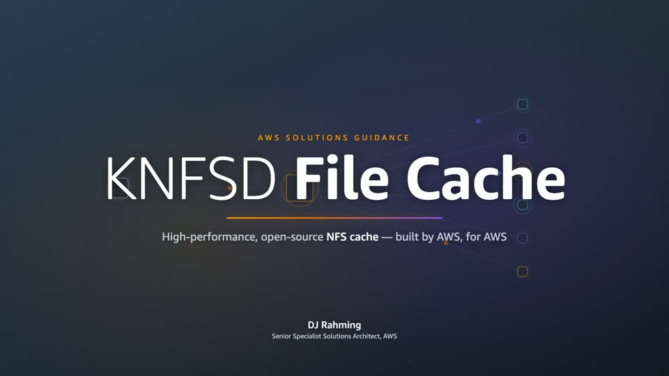

# Resources

External articles, official AWS guidance, and upstream Linux documentation related to KNFSD File Cache and NFS re-exporting.

## AWS

<!-- grid-cards:start -->
* [Launch Blog](https://aws.amazon.com/blogs/media/introducing-knfsd-file-cache-extending-your-nfs-storage-into-the-cloud/)  <!-- icon: material-book-open-variant-outline -->
  Introducing KNFSD File Cache: extending your NFS storage into the cloud.
* [AWS Solutions Guidance](https://docs.aws.amazon.com/solutions/knfsd-file-cache-on-aws/)  <!-- icon: material-aws -->
  Official AWS guidance for deploying KNFSD File Cache on AWS.
* [HPC Blog](https://aws.amazon.com/blogs/hpc/accelerating-file-reads-with-a-storage-caching-server/)  <!-- icon: material-speedometer -->
  Accelerating file reads with a storage caching server.
<!-- grid-cards:end -->

## Videos

<!-- video-cards:start -->
<table>
<tr>
<td width="50%"></td>
<td width="50%"><!-- youtube: f0pgVAq2hq4 --></td>
</tr>
</table>
<!-- video-cards:end -->

## Linux NFS

<!-- grid-cards:start -->
* [Re-exporting NFS filesystems](https://www.kernel.org/doc/html/latest/filesystems/nfs/reexport.html)  <!-- icon: material-web -->
  Upstream kernel documentation covering the constraints and caveats of re-exporting an NFS mount.
* [NFS wiki](https://linux-nfs.org/wiki/index.php/NFS_re-export)  <!-- icon: material-web -->
  Community reference on NFS re-export behaviour, including known limitations.
<!-- grid-cards:end -->
