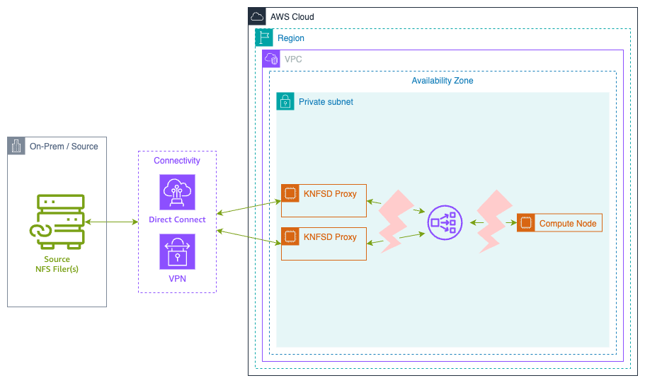

# Recovering from failure between client and Network Load Balancer

This test plan investigates the behavior of the clients when the proxy cluster is unavailable due to network connectivity issues with the Network Load Balancer (NLB).



A Network Access Control List (NACL) rule will be used to block all traffic to the Network Load Balancer subnet. This simulates network failures such as:

* Network connectivity issues between client and NLB
* Subnet-level network failures affecting the NLB
* Network infrastructure problems
* Router or switch failures

From the perspective of the client, the NLB becomes unreachable, simulating a complete network partition.

> **WARNING**: Modifying NACLs will affect ALL instances in the subnet. Only perform this test in a non-production environment.

## Prerequisites

Before running this test, ensure you have:

* AWS CLI version 2.x or later installed
* IAM permissions to:
  * Create and manage EC2 instances
  * Modify security groups
  * Access Systems Manager (if using Session Manager)
* A deployed KNFSD proxy cluster with Terraform outputs available
* SSH key pair for EC2 instance access

## Expected Test Duration

* Setup: ~10 minutes
* FIO write test: 10 minutes
* FIO read test (short): 10 minutes
* FIO read test (long): 20 minutes
* Total: ~50 minutes

## Setup

Create a KNFSD proxy cluster with a Network Load Balancer and at least one client instance in AWS.

* [Build the NFS proxy image](../../image/README.md)
* [Deploy the proxy](../../deployment/README.md)

Ensure the deployment uses `TRAFFIC_MODE = "loadbalancer"` to create a Network Load Balancer.

## Procedure

* Set Shell Variables
* Create User Data for NFS Client
* Launch NFS Client
* Verify Client Mount
* SSH to client and run FIO
* Block traffic to Network Load Balancer
* Wait for interruption
* Restore traffic to Network Load Balancer
* Wait for recovery
* Clean up

## Set Shell Variables

Set all required variables for the test. Variables marked as **REQUIRED** must be set manually or derived from Terraform outputs.

### Required Variables

```bash
# EC2 configuration
SSH_KEY_NAME=<key-name-for-ec2>             # REQUIRED: e.g., "my-test-key"
SSH_KEY_FILE=<path-to-pem-file>             # REQUIRED: e.g., ~/.ssh/my-test-key.pem (if using ~ for HOME, exclude the quotes)
PUBLIC_SUBNET=<public-subnet-id>            # REQUIRED: e.g., "subnet-0123456789abcdef0"

# Set the proxy export path (default is /files)
PROXY_EXPORT=</mount-path>                  # REQUIRED: e.g., "subnet-0123456789abcdef0"

# Network Configuration
VPC_ID=<vpc-id>                             # Can be set automatically: e.g., "vpc-0123456789abcdef0"

# Network Load Balancer configuration
NLB_DNS=<nlb-dns-name>                      # Can be set automatically: e.g., "nlb.knfsd.aws.internal"
NLB_IP=<nlb-ip-address>                     # Can be set automatically: e.g., "10.0.1.100"
NLB_SUBNET=<nlb-subnet-id>                  # Can be set automatically: e.g., "subnet-0123456789abcdef0"
NLB_NACL_ID=<nlb-nacl-id>                   # Can be set automatically: e.g., "acl-0123456789abcdef0"
```

### Derive Variables from Terraform

You can automatically populate most variables using Terraform outputs:

```bash
# Get the NLB DNS name
NLB_DNS="$(terraform output --raw dns_name)"

# Get the NLB IP address
NLB_IP="$(terraform output --raw loadbalancer_ipaddress)"

# Get the VPC ID from the Auto Scaling Group
ASG_NAME="$(terraform output --raw autoscaling_group_name)"
VPC_ID=$(aws autoscaling describe-auto-scaling-groups \
    --auto-scaling-group-names "${ASG_NAME}" \
    --query "AutoScalingGroups[0].VPCZoneIdentifier" \
    --output text | xargs -I {} aws ec2 describe-subnets \
    --subnet-ids {} \
    --query "Subnets[0].VpcId" \
    --output text)

# Get the NLB subnet by looking up the NLB's network interfaces
NLB_SUBNET=$(aws ec2 describe-network-interfaces \
    --filters "Name=addresses.private-ip-address,Values=${NLB_IP}" \
    --query "NetworkInterfaces[0].SubnetId" \
    --output text)

# Get the Network ACL for the NLB subnet
NLB_NACL_ID=$(aws ec2 describe-network-acls \
    --filters "Name=association.subnet-id,Values=${NLB_SUBNET}" \
    --query "NetworkAcls[0].NetworkAclId" \
    --output text)
```

### Validate Variables

Ensure all of the variables are properly set, for the upcoming steps:

```bash
# Display configuration for verification
echo "Configuration:"
echo " # Network Load Balancer configuration"
echo "  NLB_DNS: ${NLB_DNS}"
echo "  NLB_IP: ${NLB_IP}"
echo "  NLB_SUBNET: ${NLB_SUBNET}"
echo "  NLB_NACL_ID: ${NLB_NACL_ID}"
echo ""
echo " # Network Information"
echo "  VPC_ID: ${VPC_ID}"
echo "  PUBLIC_SUBNET: ${PUBLIC_SUBNET}"
echo ""
echo " # SSH Key Configuration"
echo "  SSH_KEY_NAME: ${SSH_KEY_NAME}"
echo "  SSH_KEY_FILE: ${SSH_KEY_FILE}"
echo ""
echo " # KNFSD Configuration"
echo "  PROXY_EXPORT: ${PROXY_EXPORT}"
```

## Create the User Data to mount the storage on launch

Create a user data script that will automatically mount the NFS proxy when the client instance launches:

```bash
cat << EOF > /tmp/knfsd-testing-userdata.sh
#!/bin/bash
set -x

# Update package list and install required packages
apt update -y
apt install nfs-common fio -y

# Enable NFS client services
systemctl enable --now nfs-client.target

# Create mount point
mkdir -p /mnt/proxy

# Mount using the NLB DNS name
mount ${NLB_DNS}:${PROXY_EXPORT} /mnt/proxy -o vers=3,rw,sync,hard,noatime,proto=tcp,mountproto=tcp

# Create test directory with open permissions
mkdir -m 777 /mnt/proxy/test

# Log completion
echo "NFS mount completed at \$(date)" >> /var/log/nfs-mount.log
EOF
```

## Launch an instance to use as a client

For these tests, we're going to use Ubuntu. Launch an instance in a public subnet with access to the proxy cluster.

### Create SSH key pair (if needed)

If you don't already have an SSH key pair, create one:

```bash
# Create key pair and save to file
aws ec2 create-key-pair \
    --key-name ${SSH_KEY_NAME} \
    --query 'KeyMaterial' \
    --output text > ${SSH_KEY_FILE}

# Set proper permissions
chmod 400 ${SSH_KEY_FILE}
```

### Create client security group

Create a security group for the client that allows SSH access and can communicate with the NLB:

```bash
# Create security group for the client
CLIENT_SG_ID=$(aws ec2 create-security-group \
    --group-name knfsd-test-client-sg \
    --description "Security group for KNFSD test client" \
    --vpc-id ${VPC_ID} \
    --query 'GroupId' \
    --output text)

echo "Created client security group: ${CLIENT_SG_ID}"

# Allow SSH access from anywhere (adjust CIDR as needed for security)
aws ec2 authorize-security-group-ingress \
    --group-id ${CLIENT_SG_ID} \
    --protocol tcp \
    --port 22 \
    --cidr 0.0.0.0/0

# Allow all outbound traffic (default, but explicit)
aws ec2 authorize-security-group-egress \
    --group-id ${CLIENT_SG_ID} \
    --protocol -1 \
    --cidr 0.0.0.0/0 2>/dev/null || true
```

### Launch the client instance

```bash
# Launch the client instance with user data
CLIENT_INSTANCE_ID=$(aws ec2 run-instances \
    --image-id resolve:ssm:/aws/service/canonical/ubuntu/server/26.04/stable/current/amd64/hvm/ebs-gp3/ami-id \
    --instance-type t3.micro \
    --key-name ${SSH_KEY_NAME} \
    --subnet-id ${PUBLIC_SUBNET} \
    --security-group-ids ${CLIENT_SG_ID} \
    --associate-public-ip-address \
    --user-data file:///tmp/knfsd-testing-userdata.sh \
    --tag-specifications 'ResourceType=instance,Tags=[{Key=Name,Value=knfsd-test-client}]' \
    --query 'Instances[0].InstanceId' \
    --output text)

echo "Launched client instance: ${CLIENT_INSTANCE_ID}"

# Wait for instance to be running
echo "Waiting for instance to be running..."
aws ec2 wait instance-running --instance-ids ${CLIENT_INSTANCE_ID}

# Get the public IP address
CLIENT_PUBLIC_IP=$(aws ec2 describe-instances \
    --instance-ids ${CLIENT_INSTANCE_ID} \
    --query 'Reservations[0].Instances[0].PublicIpAddress' \
    --output text)

echo "Client instance public IP: ${CLIENT_PUBLIC_IP}"
echo "Waiting 60 seconds for user data script to complete..."
sleep 60
```

## Verify Client Mount

Before proceeding with the test, verify that the NFS mount was successful:

```bash
# Check if mount succeeded
ssh -i ${SSH_KEY_FILE} -o StrictHostKeyChecking=no ubuntu@${CLIENT_PUBLIC_IP} \
    "df -h | grep /mnt/proxy && echo 'Mount successful' || echo 'Mount failed'"

# Check user data logs
ssh -i ${SSH_KEY_FILE} -o StrictHostKeyChecking=no ubuntu@${CLIENT_PUBLIC_IP} \
    "tail -20 /var/log/cloud-init-output.log"
```

If the mount failed, troubleshoot before continuing:

```bash
# Check if NLB is reachable
ssh -i ${SSH_KEY_FILE} -o StrictHostKeyChecking=no ubuntu@${CLIENT_PUBLIC_IP} \
    "ping -c 3 ${NLB_IP}"

# Check NFS connectivity
ssh -i ${SSH_KEY_FILE} -o StrictHostKeyChecking=no ubuntu@${CLIENT_PUBLIC_IP} \
    "showmount -e ${NLB_DNS}"
```

### SSH to client and run FIO

Open a new terminal window to connect to your client EC2 instance using SSH:

```bash
# Copy over variables from the other terminal...
SSH_KEY_FILE=<path-to-pem-file>
CLIENT_PUBLIC_IP=<client-public-ip-from-other-terminal>

# Connect to the client instance
ssh -i ${SSH_KEY_FILE} -o StrictHostKeyChecking=no ubuntu@${CLIENT_PUBLIC_IP}
```

Alternatively, if you have AWS Systems Manager configured:

```bash
# Copy over variables from the other terminal...
CLIENT_PUBLIC_IP=<client-public-ip-from-other-terminal>

# Using AWS Systems Manager Session Manager
aws ssm start-session --target ${CLIENT_INSTANCE_ID}
```

For this test we will use FIO to perform a constant write via the proxy. You can repeat this test using `--rw=read` to test the read behaviour.

When running the read test you can also set `--runtime=1200` to increase the test time to 20 minutes.

```bash
fio \
    --name=test \
    --directory=/mnt/proxy/test \
    --ioengine=libaio \
    --iodepth=64 \
    --direct=1 \
    --rw=write \
    --bs=1Mi \
    --size=1Gi \
    --time_based \
    --runtime=600 \
    --eta-newline=10
```

When running a read test you need to wait until FIO has finished laying out the file and the read test begins. Fio may skip this step if the test file already exists and is the correct size.

```text
test: Laying out IO file (1 file / 1024MiB)
Jobs: 1 (f=1): [R(1)][2.0%][r=1781MiB/s][r=1780 IOPS][eta 09m:48s]
Jobs: 1 (f=1): [R(1)][3.8%][r=1818MiB/s][r=1818 IOPS][eta 09m:37s]
Jobs: 1 (f=1): [R(1)][5.7%][r=1772MiB/s][r=1771 IOPS][eta 09m:26s]
```

Every 10 seconds (approximate) FIO will write a new status line. This will make it easier to see the interruption in the console output at the end.

### Interrupt connection

Once FIO begins, in the original terminal, run the following commands to simulate a network interruption to the Network Load Balancer.

When running a read test with `--runtime=1200` increase the interruption time from `300` seconds (5 minutes) to `900` seconds (15 minutes). This assumes the proxy is configured with `ACDIRMAX=600` (10 minutes).

> **NOTE**: The NLB_SUBNET and NLB_NACL_ID variables should have been set in the "Set Shell Variables" section above.

Network ACLs are stateless, which means they will immediately interrupt existing connections. This makes them ideal for simulating a network failure:

```bash
# Wait 2 minutes for FIO to establish baseline
echo "Waiting 2 minutes"
sleep 120

# Block all ingress traffic to the NLB subnet
echo "Blocking all ingress traffic to NLB subnet"
aws ec2 create-network-acl-entry \
    --network-acl-id "${NLB_NACL_ID}" \
    --rule-number 50 \
    --protocol -1 \
    --rule-action deny \
    --ingress \
    --cidr-block "0.0.0.0/0"

echo "Waiting 5 minutes"
sleep 300

# Restore traffic by removing the deny rule
echo "Restoring traffic to NLB subnet"
aws ec2 delete-network-acl-entry \
    --network-acl-id "${NLB_NACL_ID}" \
    --rule-number 50 \
    --ingress

echo "Traffic restored"
```

> **IMPORTANT**: Network ACLs are stateless and will affect ALL traffic to the NLB subnet, including any other services running in that subnet. This test should only be performed in a dedicated test environment.

### Wait

Wait for FIO to complete.

In the terminal connected to the remote client, you should see something like:

```text
test: (groupid=0, jobs=1): err= 0: pid=4289: Thu Nov 11 17:01:19 2021
  write: IOPS=44, BW=44.7MiB/s (46.8MB/s)(26.2GiB/600681msec); 0 zone resets
...
Run status group 0 (all jobs):
  WRITE: bw=44.7MiB/s (46.8MB/s), 44.7MiB/s-44.7MiB/s (46.8MB/s-46.8MB/s), io=26.2GiB (28.1GB), run=600681-600681msec
```

In the console running the interrupt command you should see the security group rules being modified successfully.

### Clean up

In the local terminal, clean up all resources created during the test:

```bash
# Terminate the test client instance
echo "Terminating client instance: ${CLIENT_INSTANCE_ID}"
aws ec2 terminate-instances --instance-ids ${CLIENT_INSTANCE_ID}

# Wait for instance to terminate
aws ec2 wait instance-terminated --instance-ids ${CLIENT_INSTANCE_ID}

# Delete the client security group
echo "Deleting client security group: ${CLIENT_SG_ID}"
aws ec2 delete-security-group --group-id ${CLIENT_SG_ID}

# Remove the SSH key pair (optional)
echo "Deleting SSH key pair: ${SSH_KEY_NAME}"
aws ec2 delete-key-pair --key-name ${SSH_KEY_NAME}
rm -f ${SSH_KEY_FILE}

# Remove the user data file
rm -f /tmp/knfsd-testing-userdata.sh

# Destroy the proxy cluster and related resources using Terraform
echo "Destroying Terraform resources"
terraform destroy
```

## Results

### Write test

Write test runs for 10 minutes, with a 5 minute interruption after 2 minutes.

For the first 2 minutes, FIO should show steady progress:

```text
Jobs: 1 (f=1): [W(1)][3.8%][w=84.1MiB/s][w=84 IOPS][eta 09m:37s]
```

When the traffic is blocked FIO will stop showing any write throughput or IOPS:

```text
Jobs: 1 (f=1): [W(1)][20.3%][w=95.0MiB/s][w=95 IOPS][eta 07m:58s]
Jobs: 1 (f=1): [W(1)][22.2%][eta 07m:47s]
Jobs: 1 (f=1): [W(1)][24.0%][eta 07m:36s]
Jobs: 1 (f=1): [W(1)][25.8%][eta 07m:25s]
```

The percentage will continue to increment as the eta decrements.
Once the traffic is allowed again, FIO should continue until it completes:

```text
Jobs: 1 (f=1): [W(1)][68.0%][eta 03m:12s]
Jobs: 1 (f=1): [W(1)][69.8%][eta 03m:01s]
Jobs: 1 (f=1): [W(1)][71.7%][eta 02m:50s]
Jobs: 1 (f=1): [W(1)][73.5%][w=86.0MiB/s][w=86 IOPS][eta 02m:39s]
Jobs: 1 (f=1): [W(1)][75.3%][w=94.0MiB/s][w=94 IOPS][eta 02m:28s]
...
Jobs: 1 (f=1): [W(1)][97.5%][w=96.1MiB/s][w=96 IOPS][eta 00m:15s]
Jobs: 1 (f=1): [W(1)][99.2%][w=93.1MiB/s][w=93 IOPS][eta 00m:05s]
Jobs: 1 (f=1): [W(1)][100.0%][w=91.0MiB/s][w=91 IOPS][eta 00m:00s]
test: (groupid=0, jobs=1): err= 0: pid=4259: Thu Nov 11 16:11:58 2021
  write: IOPS=44, BW=44.7MiB/s (46.8MB/s)(26.2GiB/600681msec); 0 zone resets
```

### Read test (10 minutes)

Read test runs for 10 minutes with a 5 minute interruption after 2 minutes.

After two minutes the file should be fully cached in the proxy, as such the client is able to continue reading the file during the interruption.

### Read test (20 minutes)

Read test runs for 20 minutes with a 15 minute interruption after 2 minutes.

Similar to the 10 minute test, initially the client will continue reading after the interruption. However, because the interruption is longer than the proxy's metadata cache time (`ACDIRMAX`, or `ACREGMAX`) the metadata eventually becomes invalid.

Once the metadata has become invalid the read operation will block the same as observed in the write test until the connection is resumed.

```text
Jobs: 1 (f=1): [R(1)][31.1%][r=1807MiB/s][r=1807 IOPS][eta 13m:47s]
Jobs: 1 (f=1): [R(1)][32.0%][r=1751MiB/s][r=1750 IOPS][eta 13m:36s]
Jobs: 1 (f=1): [R(1)][32.9%][r=1792MiB/s][r=1792 IOPS][eta 13m:25s]
Jobs: 1 (f=1): [R(1)][33.8%][eta 13m:14s]
Jobs: 1 (f=1): [R(1)][34.8%][eta 13m:03s]
Jobs: 1 (f=1): [R(1)][35.7%][eta 12m:52s]
...
Jobs: 1 (f=1): [R(1)][86.1%][eta 02m:47s]
Jobs: 1 (f=1): [R(1)][87.0%][eta 02m:36s]
Jobs: 1 (f=1): [R(1)][87.9%][eta 02m:25s]
Jobs: 1 (f=1): [R(1)][88.8%][r=1837MiB/s][r=1836 IOPS][eta 02m:14s]
Jobs: 1 (f=1): [R(1)][89.2%][r=2030MiB/s][r=2030 IOPS][eta 02m:10s]
Jobs: 1 (f=1): [R(1)][90.6%][r=1919MiB/s][r=1918 IOPS][eta 01m:53s]
...
Jobs: 1 (f=1): [R(1)][98.8%][r=1828MiB/s][r=1828 IOPS][eta 00m:14s]
Jobs: 1 (f=1): [R(1)][99.8%][r=1781MiB/s][r=1780 IOPS][eta 00m:03s]
Jobs: 1 (f=1): [R(1)][100.0%][r=1876MiB/s][r=1876 IOPS][eta 00m:00s]
test: (groupid=0, jobs=1): err= 0: pid=4289: Thu Nov 11 17:01:19 2021
  read: IOPS=839, BW=840MiB/s (880MB/s)(984GiB/1200024msec)
```

The connection resumed reasonably quickly when running this test. However, it might take up to 10 minutes to recover, if so the runtime for FIO may need to be increased from 20 minutes to 30 minutes.

## Troubleshooting

### Client mount fails

If the NFS mount fails on the client:

```bash
# Check if the NLB is reachable
ping -c 3 ${NLB_IP}

# Check if NFS exports are visible
showmount -e ${NLB_DNS}

# Check network connectivity on the required NFS ports
nc -zv ${NLB_IP} 2049
nc -zv ${NLB_IP} 111

# Try manual mount with verbose output
sudo mount -v ${NLB_DNS}:${PROXY_EXPORT} /mnt/proxy -o vers=3,rw,sync,hard,noatime,proto=tcp,mountproto=tcp
```

### NACL changes don't take effect

Network ACL changes should take effect immediately, but if they don't:

```bash
# Verify the NACL rule was created
aws ec2 describe-network-acls \
    --network-acl-ids ${NLB_NACL_ID} \
    --query 'NetworkAcls[0].Entries'

# Check if the rule number conflicts with existing rules
# Rule numbers are evaluated in order, lower numbers first
```

### Client cannot reach NLB

To verify the client can reach the NLB before blocking:

```bash
# From the client instance, test connectivity
ssh -i ${SSH_KEY_FILE} -o StrictHostKeyChecking=no ubuntu@${CLIENT_PUBLIC_IP} \
    "ping -c 3 ${NLB_IP}"

# Check NFS connectivity
ssh -i ${SSH_KEY_FILE} -o StrictHostKeyChecking=no ubuntu@${CLIENT_PUBLIC_IP} \
    "showmount -e ${NLB_DNS}"
```

### FIO hangs indefinitely

If FIO hangs for longer than expected (>10 minutes after restoring connectivity):

* Check that the network rules were properly removed
* Verify the NLB is responding
* Check proxy instance health in the Auto Scaling Group
* Consider increasing the test runtime to allow for maximum NFS retry timeout (600 seconds)

## Conclusion

When both the proxy and the client are mounted using the `hard` option (recommended) any NFS operations between the client and the proxy will wait for the Network Load Balancer to recover.

No manual intervention on the NLB or the clients is required.

The connection does not recover immediately. NFS has a linear backoff on retries based on the `timeo` setting, with a maximum retry time of 600 seconds (10 minutes).

### Key Findings

* **Write operations**: Block immediately when NLB becomes unavailable, resume automatically when NLB recovers
* **Read operations (short interruption)**: Continue from cache if data is cached and metadata is still valid
* **Read operations (long interruption)**: Block once metadata cache expires (default 10 minutes)
* **Recovery time**: Up to 10 minutes due to NFS retry backoff mechanism

### Best Practices

* Always use the `hard` mount option for client-to-proxy mounts
* Configure appropriate metadata cache timeouts (`ACDIRMAX`, `ACREGMAX`) based on your workload
* Monitor NFS operations during network outages to understand application behavior
* Test recovery scenarios in non-production environments before relying on automatic recovery in production

### Comparison with Other Recovery Tests

* **recovery-source**: Tests proxy-to-source interruption using NACLs (affects proxy subnet)
* **recovery-proxy**: Tests Auto Scaling Group instance replacement
* **recovery-load-balancer** (this test): Tests client-to-NLB connectivity using NACLs (affects NLB subnet)

For comprehensive testing of network failure scenarios, run all three recovery tests to understand different failure modes and recovery behaviors.
