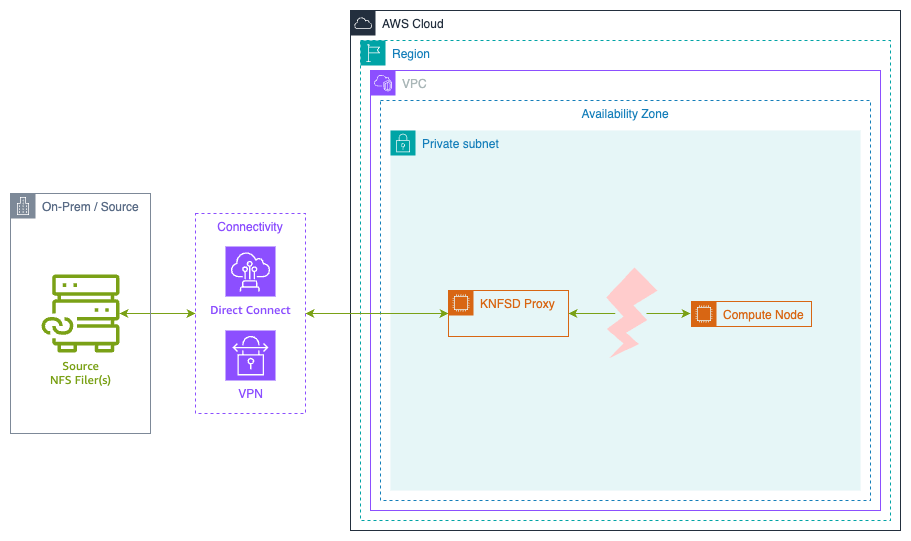

# Recovering from failure of the proxy cluster

This test plan investigates the behavior of the clients when the proxy cluster is unavailable.



Some of the reasons the entire cluster could fail are:

* Incorrect configuration scales down (or deletes) the Auto Scaling Group
* All the instances restart at the same time (e.g. due to update)
* After update, instances fail to serve NFS traffic
* Instances restart while the source server is unavailable

The proxy Auto Scaling Group will be resized to zero instances to simulate the entire cluster failing.

> **WARNING**: This test will make the entire proxy cluster unavailable. Only perform this test in a non-production environment.

## Prerequisites

Before running this test, ensure you have:

* AWS CLI version 2.x or later installed
* IAM permissions to:
  * Create and manage EC2 instances
  * Modify Auto Scaling Groups
  * Access Systems Manager (if using Session Manager)
* A deployed KNFSD proxy cluster with Terraform outputs available
* SSH key pair for EC2 instance access

## Expected Test Duration

* Setup: ~10 minutes
* FIO write test: 10 minutes
* FIO read test (short): 10 minutes
* FIO read test (long): 20 minutes
* Total: ~50 minutes

## Setup

Create a KNFSD proxy cluster with a Network Load Balancer and at least one client instance in AWS.

* [Build the NFS proxy image](../../image/README.md)
* [Deploy the proxy](../../deployment/README.md)

Ensure the deployment uses `TRAFFIC_MODE = "loadbalancer"` to create a Network Load Balancer.

## Procedure

* Set Shell Variables
* Create User Data for NFS Client
* Launch NFS Client
* Verify Client Mount
* SSH to client and run FIO
* Resize Auto Scaling Group to zero
* Wait for interruption
* Resize Auto Scaling Group back to one
* Wait for recovery
* Clean up

## Set Shell Variables

Set all required variables for the test. Variables marked as **REQUIRED** must be set manually or derived from Terraform outputs.

### Required Variables

```bash
# Proxy configuration
PROXY_BASENAME=<your-proxy-basename>        # REQUIRED: e.g., "knfsd"
PROXY_DNS=<the-proxy-dns-name>              # REQUIRED: e.g., "knfsd-a1b2c3d4.aws.internal"
PROXY_FQDN=<fully-qualified-domain-name>    # REQUIRED: e.g., "knfsd.knfsd-a1b2c3d4.aws.internal"
PROXY_EXPORT=<proxy-export-path>            # REQUIRED: e.g., "/files"

# EC2 configuration
SSH_KEY_NAME=<key-name-for-ec2>             # REQUIRED: e.g., "my-test-key"
SSH_KEY_FILE=<path-to-pem-file>             # REQUIRED: e.g., "~/.ssh/my-test-key.pem"
PUBLIC_SUBNET=<public-subnet-id>            # REQUIRED: e.g., "subnet-0123456789abcdef0"

# Auto Scaling Group (will be derived below)
ASG_NAME=<auto-scaling-group-name>          # Will be set automatically
```

### Derive Variables from Terraform

You can automatically populate most variables using Terraform outputs:

```bash
# Get the Proxy DNS entry
PROXY_DNS="$(terraform output --raw dns_name)"

# If using default values, prepend 'knfsd' to get the FQDN
PROXY_FQDN="knfsd.${PROXY_DNS}"

# Get the proxy basename
PROXY_BASENAME="$(terraform output --raw proxy_basename 2>/dev/null || echo 'knfsd')"

# Get the Auto Scaling Group name
ASG_NAME="$(terraform output --raw autoscaling_group_name)"

# Get the export path from Parameter Store
EXPORT_MAP=$(aws ssm get-parameter \
    --name "/knfsd/${PROXY_BASENAME}/EXPORT_MAP" \
    --with-decryption \
    --query 'Parameter.Value' \
    --output text)

# Parse the first export path from EXPORT_MAP
PROXY_EXPORT=$(echo ${EXPORT_MAP} | cut -d"," -f1 | cut -d";" -f3)

# Display configuration for verification
echo "Configuration:"
echo "  PROXY_BASENAME: ${PROXY_BASENAME}"
echo "  PROXY_FQDN: ${PROXY_FQDN}"
echo "  PROXY_EXPORT: ${PROXY_EXPORT}"
echo "  ASG_NAME: ${ASG_NAME}"
```

## Create the User Data to mount the storage on launch

Create a user data script that will automatically mount the NFS proxy when the client instance launches:

```bash
cat << EOF > /tmp/knfsd-testing-userdata.sh
#!/bin/bash
set -x

# Update package list and install required packages
apt update -y
apt install nfs-common fio -y

# Enable NFS client services
systemctl enable --now nfs-client.target

# Create mount point
mkdir -p /mnt/proxy

# Mount using the proxy FQDN
mount ${PROXY_FQDN}:${PROXY_EXPORT} /mnt/proxy -o vers=3,rw,sync,hard,noatime,proto=tcp,mountproto=tcp

# Create test directory with open permissions
mkdir -m 777 /mnt/proxy/test

# Log completion
echo "NFS mount completed at \$(date)" >> /var/log/nfs-mount.log
EOF
```

## Launch an instance to use as a client

Launch an instance in a public subnet with access to the proxy cluster.

### Create SSH key pair (if needed)

If you don't already have an SSH key pair, create one:

```bash
# Create key pair and save to file
aws ec2 create-key-pair \
    --key-name ${SSH_KEY_NAME} \
    --query 'KeyMaterial' \
    --output text > ${SSH_KEY_FILE}

# Set proper permissions
chmod 400 ${SSH_KEY_FILE}
```

### Launch the client instance

```bash
# Launch the client instance with user data
CLIENT_INSTANCE_ID=$(aws ec2 run-instances \
    --image-id resolve:ssm:/aws/service/canonical/ubuntu/server/26.04/stable/current/amd64/hvm/ebs-gp3/ami-id \
    --instance-type t3.micro \
    --key-name ${SSH_KEY_NAME} \
    --subnet-id ${PUBLIC_SUBNET} \
    --associate-public-ip-address \
    --user-data file:///tmp/knfsd-testing-userdata.sh \
    --tag-specifications 'ResourceType=instance,Tags=[{Key=Name,Value=knfsd-test-client}]' \
    --query 'Instances[0].InstanceId' \
    --output text)

echo "Launched client instance: ${CLIENT_INSTANCE_ID}"

# Wait for instance to be running
echo "Waiting for instance to be running..."
aws ec2 wait instance-running --instance-ids ${CLIENT_INSTANCE_ID}

# Get the public IP address
CLIENT_PUBLIC_IP=$(aws ec2 describe-instances \
    --instance-ids ${CLIENT_INSTANCE_ID} \
    --query 'Reservations[0].Instances[0].PublicIpAddress' \
    --output text)

echo "Client instance public IP: ${CLIENT_PUBLIC_IP}"
echo "Waiting 60 seconds for user data script to complete..."
sleep 60
```

## Verify Client Mount

Before proceeding with the test, verify that the NFS mount was successful:

```bash
# Check if mount succeeded
ssh -i ${SSH_KEY_FILE} -o StrictHostKeyChecking=no ubuntu@${CLIENT_PUBLIC_IP} \
    "df -h | grep /mnt/proxy && echo 'Mount successful' || echo 'Mount failed'"

# Check user data logs
ssh -i ${SSH_KEY_FILE} -o StrictHostKeyChecking=no ubuntu@${CLIENT_PUBLIC_IP} \
    "tail -20 /var/log/cloud-init-output.log"
```

If the mount failed, troubleshoot before continuing:

```bash
# Check if proxy is reachable
ssh -i ${SSH_KEY_FILE} -o StrictHostKeyChecking=no ubuntu@${CLIENT_PUBLIC_IP} \
    "ping -c 3 ${PROXY_FQDN}"

# Check NFS connectivity
ssh -i ${SSH_KEY_FILE} -o StrictHostKeyChecking=no ubuntu@${CLIENT_PUBLIC_IP} \
    "showmount -e ${PROXY_FQDN}"
```

### SSH to client and run FIO

Connect to your client EC2 instance using SSH:

Install FIO and mount the NFS proxy:

```bash
# Connect to the client instance
ssh -i ${SSH_KEY_FILE} -o StrictHostKeyChecking=no ubuntu@${CLIENT_PUBLIC_IP}
```

Alternatively, if you have AWS Systems Manager configured:

```bash
# Using AWS Systems Manager Session Manager
aws ssm start-session --target ${CLIENT_INSTANCE_ID}
```

For this test we will use FIO to perform a constant write via the proxy. You can repeat this test using `--rw=read` to test the read behaviour.

When running the read test you can also set `--runtime=1200` to increase the test time to 20 minutes.

```bash
fio \
    --name=test \
    --directory=/mnt/proxy/test \
    --ioengine=libaio \
    --iodepth=64 \
    --direct=1 \
    --rw=write \
    --bs=1Mi \
    --size=1Gi \
    --time_based \
    --runtime=600 \
    --eta-newline=10
```

When running a read test you need to wait until FIO has finished laying out the file and the read test begins. Fio may skip this step if the test file already exists and is the correct size.

```text
Starting 1 process
test: Laying out IO file (1 file / 1024MiB)
Jobs: 1 (f=1): [W(1)][2.0%][w=2048KiB/s][w=2 IOPS][eta 09m:48s]
Jobs: 1 (f=1): [W(1)][3.8%][w=1025KiB/s][w=1 IOPS][eta 09m:37s]
Jobs: 1 (f=1): [W(1)][4.3%][w=1025KiB/s][w=1 IOPS][eta 09m:34s]
```

Every 10 seconds (approximate) FIO will write a new status line. This will make it easier to see the interruption in the console output at the end.

### Resize Auto Scaling Group

Once FIO begins, resize the Auto Scaling Group to zero. This will simulate either losing connection to the proxy, or the proxy failing.

When running a read test with `--runtime=1200` increase the interruption time from 300 seconds (5 minutes) to 900 seconds (15 minutes). This assumes the proxy is configured with `ACDIRMAX=600` (10 minutes).

> **NOTE**: The ASG_NAME variable should have been set in the "Set Shell Variables" section above.

```bash
# Wait 2 minutes for FIO to establish baseline
echo "Waiting 2 minutes"
sleep 120

# Resize to zero instances
echo "Scaling Auto Scaling Group to zero instances"
aws autoscaling set-desired-capacity \
    --auto-scaling-group-name "${ASG_NAME}" \
    --desired-capacity 0

# Wait for instances to terminate
echo "Waiting for instances to terminate..."
aws ec2 wait instance-terminated \
    --instance-ids $(aws autoscaling describe-auto-scaling-groups \
        --auto-scaling-group-names "${ASG_NAME}" \
        --query 'AutoScalingGroups[0].Instances[*].InstanceId' \
        --output text)

echo "Waiting 5 minutes"
sleep 300

# Resize back to one instance
echo "Scaling Auto Scaling Group back to one instance"
aws autoscaling set-desired-capacity \
    --auto-scaling-group-name "${ASG_NAME}" \
    --desired-capacity 1

# Wait for the new instance to be in service
echo "Waiting for new instance to be in service..."
aws autoscaling wait group-in-service \
    --auto-scaling-group-name "${ASG_NAME}"

echo "Proxy cluster recovered"
```

### Wait

Wait for FIO to complete.

You should see something like:

```text
test: (groupid=0, jobs=1): err= 0: pid=63676: Wed Nov 17 09:28:30 2021
  write: IOPS=0, BW=936KiB/s (959kB/s)(656MiB/717505msec); 0 zone resets
```

```bash
Run status group 0 (all jobs):
  WRITE: bw=936KiB/s (959kB/s), 936KiB/s-936KiB/s (959kB/s-959kB/s), io=656MiB (688MB), run=717505-717505msec
```

In the console running the resize commands you should see the Auto Scaling Group being scaled down and back up successfully.

### Clean up

Clean up all resources created during the test:

```bash
# Terminate the test client instance
echo "Terminating client instance: ${CLIENT_INSTANCE_ID}"
aws ec2 terminate-instances --instance-ids ${CLIENT_INSTANCE_ID}

# Wait for instance to terminate
aws ec2 wait instance-terminated --instance-ids ${CLIENT_INSTANCE_ID}

# Remove the SSH key pair (optional)
echo "Deleting SSH key pair: ${SSH_KEY_NAME}"
aws ec2 delete-key-pair --key-name ${SSH_KEY_NAME}
rm -f ${SSH_KEY_FILE}

# Remove the user data file
rm -f /tmp/knfsd-testing-userdata.sh

# Destroy the proxy cluster and related resources using Terraform
echo "Destroying Terraform resources"
terraform destroy
```

## Results

### Write test

Write test runs for 10 minutes, with a 5 minute interruption after 2 minutes.

For the first 2 minutes, FIO should show steady progress. When the proxy cluster is scaled to zero, FIO will stop showing any write throughput or IOPS. The percentage will continue to increment as the ETA decrements.

Once the proxy cluster is scaled back up and instances are in service, FIO should continue until it completes.

### Read test (10 minutes)

Read test runs for 10 minutes with a 5 minute interruption after 2 minutes.

After two minutes the file should be fully cached in the proxy, as such the client is able to continue reading the file during the interruption.

### Read test (20 minutes)

Read test runs for 20 minutes with a 15 minute interruption after 2 minutes.

Similar to the 10 minute test, initially the client will continue reading after the interruption. However, because the interruption is longer than the proxy's metadata cache time (`ACDIRMAX`, or `ACREGMAX`) the metadata eventually becomes invalid.

Once the metadata has become invalid the read operation will block the same as observed in the write test until the connection is resumed.

The connection resumed reasonably quickly when running this test. However, it might take up to 10 minutes to recover, if so the runtime for FIO may need to be increased from 20 minutes to 30 minutes.

## Troubleshooting

### Client mount fails

If the NFS mount fails on the client:

```bash
# Check if the proxy is reachable
ping -c 3 ${PROXY_FQDN}

# Check if NFS exports are visible
showmount -e ${PROXY_FQDN}

# Check network connectivity on the required NFS ports
nc -zv ${PROXY_FQDN} 2049
nc -zv ${PROXY_FQDN} 111

# Try manual mount with verbose output
sudo mount -v ${PROXY_FQDN}:${PROXY_EXPORT} /mnt/proxy -o vers=3,rw,sync,hard,noatime,proto=tcp,mountproto=tcp
```

### Auto Scaling Group doesn't scale

If the Auto Scaling Group doesn't scale as expected:

```bash
# Check the current state of the Auto Scaling Group
aws autoscaling describe-auto-scaling-groups \
    --auto-scaling-group-names "${ASG_NAME}" \
    --query 'AutoScalingGroups[0].[DesiredCapacity,MinSize,MaxSize,Instances[*].[InstanceId,LifecycleState]]'

# Check Auto Scaling Group activities for errors
aws autoscaling describe-scaling-activities \
    --auto-scaling-group-name "${ASG_NAME}" \
    --max-records 10
```

### Proxy doesn't become healthy after scaling up

If the proxy instance doesn't pass health checks after scaling up:

```bash
# Get the new proxy instance ID
NEW_PROXY_INSTANCE_ID=$(aws autoscaling describe-auto-scaling-groups \
    --auto-scaling-group-names "${ASG_NAME}" \
    --query 'AutoScalingGroups[0].Instances[0].InstanceId' \
    --output text)

# Check instance status
aws ec2 describe-instance-status --instance-ids ${NEW_PROXY_INSTANCE_ID}

# Check system logs
aws ec2 get-console-output --instance-id ${NEW_PROXY_INSTANCE_ID}

# Connect to the instance and check NFS server status
aws ssm start-session --target ${NEW_PROXY_INSTANCE_ID}
# On the proxy instance:
sudo systemctl status nfs-server
sudo journalctl -u nfs-server -n 50
```

### FIO hangs indefinitely

If FIO hangs for longer than expected (>10 minutes after proxy recovery):

* Check that the Auto Scaling Group has scaled back up
* Verify the new proxy instance is healthy and in service
* Check that the Network Load Balancer target group shows healthy targets
* Verify the source NFS server is responding
* Consider increasing the test runtime to allow for maximum NFS retry timeout (600 seconds)

## Conclusion

When both the proxy and the client are mounted using the `hard` option (recommended) any NFS operations between the client and the proxy will wait for the proxy to recover.

No manual intervention on the proxy or the clients is required.

The connection does not recover immediately. NFS has a linear backoff on retries based on the `timeo` setting, with a maximum retry time of 600 seconds (10 minutes).

### Key Findings

* **Write operations**: Block immediately when proxy becomes unavailable, resume automatically when proxy recovers
* **Read operations (short interruption)**: Continue from cache if data is cached and metadata is still valid
* **Read operations (long interruption)**: Block once metadata cache expires (default 10 minutes)
* **Recovery time**: Up to 10 minutes due to NFS retry backoff mechanism

### Network Load Balancer Benefits

The Network Load Balancer provides a static IP for the clients, so the proxy instances can be recreated with a different IP address without affecting the clients or requiring manual intervention.

When using DNS round-robin mode (`TRAFFIC_MODE = "dns_round_robin"`), the Lambda function automatically manages static private IPv4 addresses for each proxy instance, ensuring clients can reconnect even when instances are replaced.

### Best Practices

* Always use the `hard` mount option for client-to-proxy mounts
* Configure appropriate metadata cache timeouts (`ACDIRMAX`, `ACREGMAX`) based on your workload
* Monitor Auto Scaling Group health and scaling activities
* Set appropriate health check grace periods to allow proxy instances time to start up
* Test recovery scenarios in non-production environments before relying on automatic recovery in production
