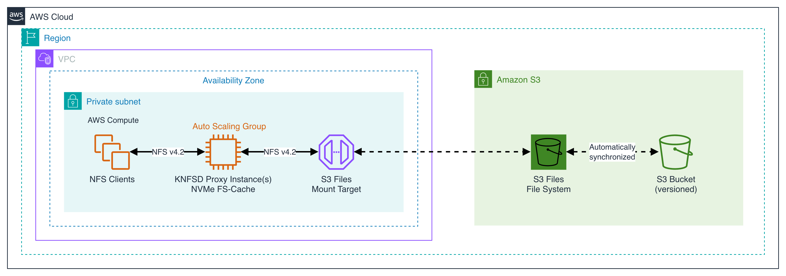

# Amazon S3 Files Example



[Amazon S3 Files](https://docs.aws.amazon.com/AmazonS3/latest/userguide/s3-files.html) is a shared file system that connects compute directly with Amazon S3 data. Built on Amazon EFS, S3 Files supports NFS v4.1 and NFS v4.2. By default, the `mount.s3files` helper mounts using NFS v4.2.

[Tutorial: Getting Started with Amazon S3 Files](https://docs.aws.amazon.com/AmazonS3/latest/userguide/s3-files-getting-started.html) is recommended.

This example provisions a single KNFSD proxy re-exporting an S3 Files filesystem backed by a single, versioned S3 bucket (standard storage class). The KNFSD proxy and S3 Files mount target are deployed in the same Availability Zone to minimize inter-AZ data transfer costs.

For simplicity this example uses some settings that are not recommended for production:

* `FSID_MODE = "static"`

This deploys the KNFSD proxy cluster without a shared FSID database. In production it is recommended to use a shared (`"external"`) FSID database to ensure that all the KNFSD proxy instances in the cluster allocate the same FSID to each export.

## S3 Files Utilities

S3 Files uses the [amazon-efs-utils](https://github.com/aws/efs-utils) package (v3.1.0+, already installed via the Packer image build) which provides the `mount.s3files` mount helper. This helper establishes a local TLS proxy (stunnel) for encrypted NFS v4.2 connections to the S3 Files mount target, providing higher per-client throughput.

## Mounting S3 Files

S3 Files does not support the `showmount` command, so the filesystem type must be identified in the `EXPORT_MAP` variable. This example uses the mount target filesystem ID and sets the 4th field to `s3files`:

```hcl
# <SOURCE_IP/FILESYSTEM_ID/DNS_NAME>;<SOURCE_EXPORT>;<TARGET_EXPORT>;<FILESYSTEM_TYPE>
EXPORT_MAP = "${aws_s3files_mount_target.s3files.file_system_id};/;/s3files;s3files"
```

The KNFSD proxy mounts the S3 Files filesystem using NFS v4.2 (`NFS_MOUNT_VERSION = "4.2"`) with all other NFS versions disabled (`DISABLED_NFS_VERSIONS = "3,4.0,4.1"`).

See `man mount.s3files` on the KNFSD instance for additional mount options specific to S3 Files that can be applied via the Terraform `MOUNT_OPTIONS` variable.

## Mount Options

* `noresvport` (default) - Do not use a reserved source port. Required for S3 Files mount targets behind elastic network interfaces.
* `nodirects3read` (optional) - Disable the direct S3 read path. When specified, all read operations go through the standard NFS data path instead of reading directly from S3.

## Synchronization

This example configures an S3 Files synchronization policy with `size_less_than = 131072` (128 KiB). Files at or below 128 KiB are cached on S3 Files high-performance storage for low-latency access, while larger files are streamed directly from Amazon S3 for high throughput. Cached data expires after 30 days of no access.

## IAM Requirements

This example creates the following IAM roles and policies:

**S3 Files service role** - assumed by the `elasticfilesystem.amazonaws.com` service to manage the S3 Files filesystem:

* S3 bucket and object permissions (list, get, put, delete) on the backing S3 bucket
* EventBridge permissions for synchronization rules

**KNFSD proxy compute role** - Attached to the KNFSD proxy instance role via `module.proxy.iam_role_name`:

* `AmazonS3FilesClientFullAccess` - Grants `s3files:ClientMount`, `s3files:ClientWrite`, `s3files:ClientRootAccess`
* `AmazonElasticFileSystemsUtils` - Grants CloudWatch mount status monitoring permissions used by `amazon-efs-utils`
* Inline S3 read policy - Grants `s3:GetObject`, `s3:GetObjectVersion`, `s3:ListBucket` on the backing S3 bucket for direct reads

## Security Groups

This example creates a dedicated security group for the S3 Files mount target (proxy to source), allowing inbound NFS traffic from the proxy ASG security group.

You will need to create or append to existing security group(s) for:

* NFS traffic; NFS clients to connect to the KNFSD proxy instances

See [Security Groups](../../deployment/docs/security-groups.md).

There are a number of ways to [monitor](../../docs/check-startup.md) the deployment progress.

## IAM Permissions

This example creates Amazon S3 and Amazon S3 Files resources (`aws_s3_bucket`, `aws_s3_bucket_versioning`, `aws_s3_bucket_public_access_block`, `aws_s3files_file_system`, `aws_s3files_synchronization_configuration`, `aws_s3files_mount_target`) that are not covered by the project-wide IAM policies under [docs/iam/](../../docs/iam/). The additional `s3:*` (scoped to `knfsd-*` buckets), `s3files:*`, mount-target `ec2:*Network*` networking, EventBridge management for the S3 Files-managed `DO-NOT-DELETE-S3-Files*` sync rules, `iam:PassRole` (for `elasticfilesystem.amazonaws.com`) and `iam:CreateServiceLinkedRole` (for `elasticfilesystem.amazonaws.com`) permissions required to deploy this example are provided in [iam.json](iam.json) and should be attached to the same principal that runs `terraform apply` for this example, alongside [docs/iam/tf-required.json](../../docs/iam/tf-required.json) and [docs/iam/tf-optional.json](../../docs/iam/tf-optional.json) (when applicable). See [docs/iam.md](../../docs/iam.md) for the full IAM reference.

## Inputs

* `REGION` - (Required) The AWS region to use for deployment of the KNFSD File Cache. Example: `us-east-1`. No default.

* `SUBNET` - (Required) The single subnet ID to use for deployment of the KNFSD File Cache. Example: `subnet-038e337f0ff4cd53f`. No default.

* `PROXY_AMI` - (Required) The AMI ID to use for the KNFSD caching proxy. This should be built using the Packer [image build](../../image/README.md) script. No default.

* `PROXY_BASENAME` - (Optional) Prefix used to name AWS resources. Every deployment in an AWS account MUST be given a unique basename to avoid conflicts (some of the resources created must have a globally unique name within an AWS account). Default: `knfsd`.

* `KEY_NAME` - (Optional) The name of the key pair to use for the KNFSD instances. Leave BLANK to use AWS SSM. Default: `""`.

* `INSTANCE_TYPE` - (Optional) The AWS EC2 instance type to use for the KNFSD cache. Default: `i3en.6xlarge`.

* `KNFSD_NODES` - (Optional) The number of KNFSD instances to deploy as part of the cluster. Default: `1`.

## Outputs

* `autoscaling_group_name` - Name of the KNFSD proxy Auto Scaling Group.

* `autoscaling_group_security_group_id` - Security Group ID for the KNFSD proxy Auto Scaling Group.

* `dns_name` - The private DNS name of the KNFSD Network Load Balancer or Auto Scaling Group (when `TRAFFIC_MODE` is `dns_round_robin` or `loadbalancer`).

* `loadbalancer_ipaddress` - The private IP address of the Network Load Balancer (when `TRAFFIC_MODE = "loadbalancer"`).

* `knfsd_security_group_id` - Security Group ID for the NFS clients to connect to the KNFSD proxy instances (when `TRAFFIC_MODE` is `dns_round_robin` or `loadbalancer`).

* `s3_bucket_name` - Name of the S3 bucket backing the S3 Files filesystem.

* `s3files_mount_target_dns_name` - DNS name of the S3 Files mount target.

* `s3files_mount_target_ipv4_address` - IPv4 address of the S3 Files mount target.

## Cleanup (`terraform destroy`)

The S3 bucket backing S3 Files has versioning `Enabled` (required by S3 Files),
so `terraform destroy` would normally fail with `BucketNotEmpty` if any objects
(or non-current versions / delete markers) remain:

```text
Error: deleting S3 Bucket (...): ... BucketNotEmpty: The bucket you tried to
delete is not empty. You must delete all versions in the bucket.
```

To keep `terraform destroy` a one-shot for this demo, the bucket is declared
with `force_destroy = true`. On destroy, the AWS provider empties the bucket
(including all object versions and delete markers) before deleting it.

This is safe only because the bucket is ephemeral and exists solely for this
example. Do **NOT** use `force_destroy = true` on production S3 buckets.

## Amazon S3 Files Limitations

Amazon S3 Files does not support being re-exported more than once, so does not support the `fanout` feature. You will see a "stale file handle" error on the 2nd tier KNFSD proxy, with a loss of metadata on the 1st and 2nd tier KNFSD proxies.

Please note the [unsupported features, limits, and quotas](https://docs.aws.amazon.com/AmazonS3/latest/userguide/s3-files-quotas.html) in S3 Files.

## Troubleshooting

See the [Troubleshooting S3 Files](https://docs.aws.amazon.com/AmazonS3/latest/userguide/s3-files-troubleshooting.html) guide for more information.
