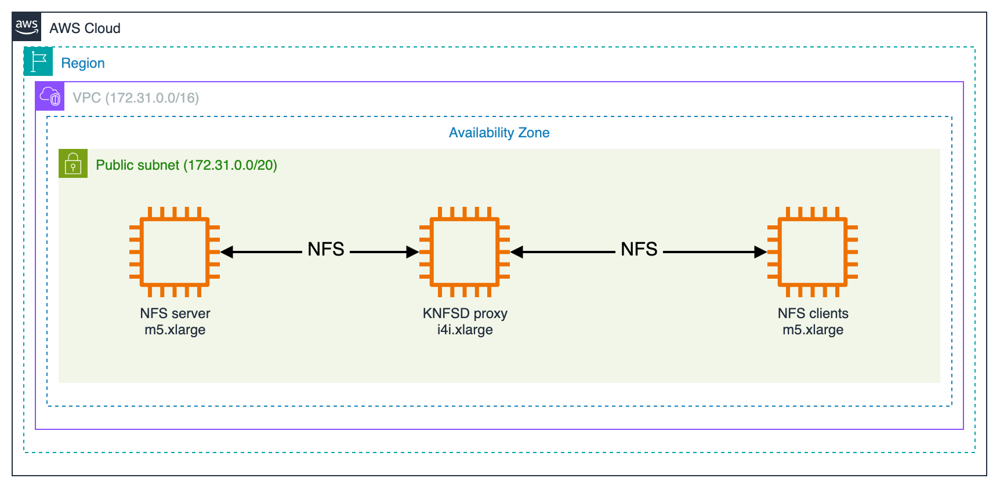
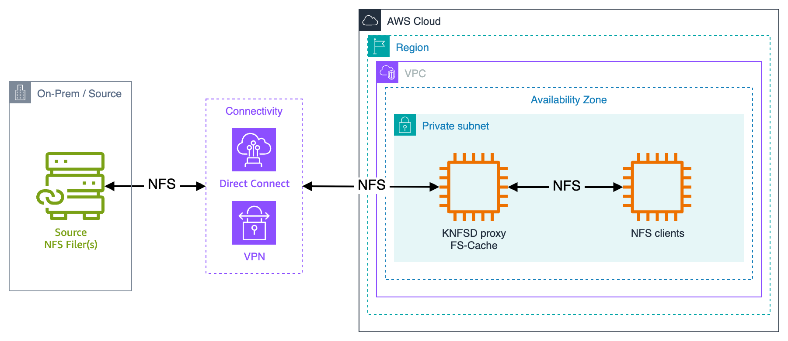

# Deploy a kernel space NFS caching proxy on AWS

> **NOTE**: This tutorial guides you through the step-by-step process of deploying a simplified, fully self-contained test environment. It foregoes the usage of Terraform/Packer and uses simplified startup scripts. It also removes many of the advanced features you might want to use for configuring the system in your production environment. For production deployments, see the [main deployment documentation](https://github.com/awslabs/knfsd-file-cache).

## Table of Contents

* [Introduction](#introduction)
* [Architecture](#architecture)
* [Hybrid Architecture](#hybrid-architecture)
* [Prerequisites](#prerequisites)
* [Objectives](#objectives)
* [Costs](#costs)
* [Download the tutorial files](#download-the-tutorial-files)
* [Deploy the NFS source server](#deploy-the-nfs-source-server)
* [Deploy the NFS proxy](#deploy-the-knfsd-caching-proxy)
* [Deploy the NFS client](#deploy-the-nfs-client)
* [Test the system](#test-the-system)
* [Advanced workflow topics](#advanced-workflow-topics)
* [Clean up](#clean-up)

## Introduction

This tutorial shows you how to deploy, configure, and test a Linux-based, kernel-space Network File System (NFS) caching proxy in Amazon Web Services (AWS). The architecture that's described in this tutorial is designed for a scenario in which read-only data is synchronized at a byte level from an NFS origin file server (such as an on-premises NFS file server) to AWS, or synchronized on demand from one primary source of truth to multiple read-only replicas.

This tutorial assumes that you're familiar with the following:

* Building custom versions of the Linux operating system.
* Installing and configuring software with startup scripts in Amazon Web Services (AWS).
* Configuring and managing an NFS file system.

This architecture doesn't support file locking. The architecture is best suited for pipelines that use unique filenames to track file versions.

## Architecture

The architecture in this tutorial has a kernel-space NFS Daemon (KNFSD) that acts as an NFS proxy and cache. This setup gives your cloud-based compute nodes access to local, fast storage by migrating data when an NFS client requests it. NFS client nodes write data directly back to your NFS origin file server using write-through caching. The following diagram shows this architecture:



In this tutorial, you will deploy and test the KNFSD proxy system. You will create a KNFSD Amazon Machine Image (AMI) and configure a single NFS server, a single KNFSD proxy, and a single NFS client all in Amazon Web Services (AWS).

The KNFSD proxy system works by mounting a volume from the NFS server and re-exporting that volume. The NFS client mounts the re-exported volume from the proxy. When an NFS client requests data, the KNFSD proxy checks its various cache tables to determine whether the data resides locally. If the data is already in the cache, the KNFSD proxy serves it immediately. If the data requested isn't in the cache, the proxy migrates the data, updates its cache tables, and then serves the data. The KNFSD proxy caches both file data and metadata at a byte level, so only the bytes that are used are transferred as they are requested.

The KNFSD proxy has two layers of cache: L1 and L2. L1 is the standard block cache of the operating system that resides in RAM. When the volume of data exceeds available RAM, L2 cache is implemented by using FS-Cache, a Linux kernel module that caches data locally on disk. In this deployment, you use local NVMe instance store as your L2 cache, although you can configure the system in several ways.

To implement the architecture in this tutorial, you will use standard NFS tools, which are compatible with NFS versions 2, 3, and 4.

In this tutorial, you'll create three Amazon EC2 instances:

1. **NFS Server**: An `c6i.xlarge` instance using its root volume to serve test data
2. **KNFSD Proxy**: An `i4i.4xlarge` instance with local NVMe instance store for L2 caching
3. **NFS Client**: An `c6in.4xlarge` instance to test the caching performance

## Hybrid Architecture

In a hybrid architecture, NFS clients that are running in AWS request data when it's needed. These requests are made to the KNFSD proxy, which serves data from its local cache if present. If the data isn't in the cache, the proxy manages communication back to the on-premises servers. The system can mount single or multiple NFS origin servers. The proxy manages all communication and data migration necessary through a VPN or Direct Connect connection back to the on-premises NFS origin servers. The following diagram shows this KNFSD deployment in a hybrid architecture:



## Prerequisites

Before starting this tutorial, ensure you have:

* An AWS account with appropriate permissions
* `git` and `ssh` installed on your local machine
* [AWS CLI](https://docs.aws.amazon.com/cli/latest/userguide/getting-started-install.html) installed and configured with your credentials and AWS region (e.g. `us-east-1` for N. Virginia)
* Basic understanding of NFS and Amazon EC2
* Sufficient EC2 service quotas:
  * At least 36 vCPUs for On-Demand instances (4 for `c6i.xlarge` + 16 for `i4i.4xlarge` + 16 for `c6in.4xlarge`)
  * If needed, request a [quota increase](https://console.aws.amazon.com/servicequotas/home) for your AWS region

## Objectives

* Deploy and test a KNFSD proxy system.
* Create and configure the following components in AWS:
  * An NFS server
  * A KNFSD proxy
  * An NFS client
* Copy a file from the NFS server through the KNFSD proxy to the NFS client
* Observe the performance of the system

## Costs

The cost of this tutorial is [estimated](https://calculator.aws/#/estimate?id=580bc8fc88ab795b6756a237b2b41893a012588a) to be $2.47/hr, running in `us-east-1` (N. Virginia) region.

* `c6i.xlarge`: $0.17/hr
* `i4i.4xlarge`: $1.373/hr
* `c6in.4xlarge`: $0.9072/hr
* `EBS GP3 volumes`: 50GB x2, 10GB x1: $0.023/hr

### AWS Credentials

If using static credentials, ensure you run `aws configure` to set the `AWS Access Key ID`, `AWS Secret Access Key`, and `Default region name`.

```bash
$ aws configure

AWS Access Key ID [************************]:
AWS Secret Access Key [********************]:
Default region name []: us-east-1
Default output format []: json
```

## Download the tutorial files

Clone the GitHub repository and navigate to the tutorial directory:

```bash
cd ~
git clone https://github.com/awslabs/knfsd-file-cache.git
cd knfsd-file-cache/tutorial
```

## Deploy the NFS source server

In this section, you will create an Amazon EC2 instance to act as the NFS source server and configure it to export an NFS share from its root volume.

First, get the VPC ID, security group ID, and subnet ID for the default VPC:

```bash
# Get the VPC ID
VPC_ID=$(aws ec2 describe-vpcs \
  --filters "Name=isDefault,Values=true" \
  --query 'Vpcs[0].VpcId' \
  --output text)

echo "VPC_ID: $VPC_ID"

# Get the security group ID for the VPC
SG_ID=$(aws ec2 describe-security-groups \
  --filters "Name=vpc-id,Values=$VPC_ID" "Name=group-name,Values=default" \
  --query 'SecurityGroups[0].GroupId' \
  --output text)

echo "SG_ID: $SG_ID"

# Get the first subnet ID in the VPC
SUBNET=$(aws ec2 describe-subnets \
  --filters "Name=vpc-id,Values=$VPC_ID" \
  --query 'Subnets[0].SubnetId' \
  --output text)

echo "SUBNET: $SUBNET"
```

> **NOTE**: The default security group allows all traffic between instances that use the same security group within your VPC, which means all NFS ports (111, 2049, etc) will work automatically between your tutorial instances.

Optionally, add SSH access from your IP to the default security group:

```bash
# Optional: Add SSH access from your IP
MY_IP=$(curl -s https://checkip.amazonaws.com)
aws ec2 authorize-security-group-ingress \
  --group-id $SG_ID \
  --protocol tcp \
  --port 22 \
  --cidr ${MY_IP}/32

echo "Added SSH access from $MY_IP to security group $SG_ID"
```

Create a key pair (or update the `--key-name` if you already have a key pair):

```bash
# Create a key pair
aws ec2 create-key-pair \
  --key-name knfsd-tutorial \
  --query 'KeyMaterial' \
  --output text > knfsd-tutorial.pem

chmod 400 knfsd-tutorial.pem
```

Get the Ubuntu AMI ID and launch the NFS server instance:

```bash
# Get the latest Ubuntu 24.04 AMI ID
AMI_ID=$(aws ssm get-parameters \
  --names /aws/service/canonical/ubuntu/server/24.04/stable/current/amd64/hvm/ebs-gp3/ami-id \
  --query 'Parameters[].Value' \
  --output text)

echo "Using AMI: $AMI_ID"

# Launch the instance
SERVER_INSTANCE_ID=$(aws ec2 run-instances \
  --image-id $AMI_ID \
  --instance-type c6i.xlarge \
  --subnet-id $SUBNET \
  --key-name knfsd-tutorial \
  --security-group-ids $SG_ID \
  --user-data file://nfs-server-startup.sh \
  --tag-specifications \
    'ResourceType=instance,Tags=[{Key=Name,Value=nfs-server},{Key=knfsd-file-cache:tutorial,Value=nfs-server}]' \
  --block-device-mappings \
    'DeviceName=/dev/sda1,Ebs={VolumeSize=50,VolumeType=gp3,DeleteOnTermination=true}' \
  --query 'Instances[0].InstanceId' \
  --output text)

echo "Launched nfs-server: $SERVER_INSTANCE_ID"

# Wait for the instance to be running
aws ec2 wait instance-running --instance-ids $SERVER_INSTANCE_ID

# Get the private IP address
NFS_SERVER=$(aws ec2 describe-instances \
  --instance-ids $SERVER_INSTANCE_ID \
  --query 'Reservations[0].Instances[0].PrivateIpAddress' \
  --output text)

echo "NFS server IP: $NFS_SERVER"
```

### Verify the NFS server

Wait 2-3 minutes for the instance to complete startup and for the user data script to create the test file, then connect via SSH (`ssh -i knfsd-tutorial.pem ubuntu@$NFS_SERVER`) or Session Manager and verify:

  ```bash
  # check cloud-init
  cloud-init status --wait
  # status: done

  # tail the cloud-init output log
  cat /var/log/cloud-init-output.log

  # check the test file exists
  ls -lh /data/test.data

  # check NFS exports
  sudo exportfs -v
  ```

  You should see the 10GB test file in `/data`.

## Deploy the KNFSD caching proxy

In this section, you create an Amazon EC2 instance with local NVMe instance store to act as the KNFSD caching proxy. This instance will use the same default security group as the NFS server.

```bash
# Create a combined user-data script with the NFS_SERVER variable set earlier to the NFS server's private IP address
cat > nfs-proxy-startup-user-data.sh << EOF
#!/usr/bin/env bash
export NFS_SERVER="${NFS_SERVER}"
$(tail -n +2 nfs-proxy-startup.sh)
EOF

# Launch the instance using the default security group
PROXY_INSTANCE_ID=$(aws ec2 run-instances \
  --image-id $AMI_ID \
  --instance-type i4i.4xlarge \
  --subnet-id $SUBNET \
  --key-name knfsd-tutorial \
  --security-group-ids $SG_ID \
  --user-data file://nfs-proxy-startup-user-data.sh \
  --tag-specifications \
    'ResourceType=instance,Tags=[{Key=Name,Value=nfs-proxy},{Key=knfsd-file-cache:tutorial,Value=nfs-proxy}]' \
  --block-device-mappings \
    'DeviceName=/dev/sda1,Ebs={VolumeSize=10,VolumeType=gp3,DeleteOnTermination=true}' \
  --query 'Instances[0].InstanceId' \
  --output text)

echo "Launched nfs-proxy: $PROXY_INSTANCE_ID"

# Wait for the instance to be running
aws ec2 wait instance-running --instance-ids $PROXY_INSTANCE_ID

# Get the private IP address
NFS_PROXY=$(aws ec2 describe-instances \
  --instance-ids $PROXY_INSTANCE_ID \
  --query 'Reservations[0].Instances[0].PrivateIpAddress' \
  --output text)

echo "NFS proxy IP: $NFS_PROXY"
```

### Verify the KNFSD proxy

Wait 2-3 minutes for the instance to complete startup, then connect via SSH (`ssh -i knfsd-tutorial.pem ubuntu@$NFS_PROXY`) or Session Manager and verify:

  ```bash
  # check the FS-Cache is mounted, 858 GB should be available
  df -h /var/cache/fscache

  # check the FS-Cache stats
  cat /proc/fs/fscache/stats

  # check the NFS server is mounted
  mount | grep /srv/nfs

  # check the NFS exports
  sudo exportfs -v
  ```

  You should see the FS-Cache is mounted, the NFS server is mounted at `/srv/nfs/data`, and the re-export is configured.

## Deploy the NFS client

In this section, you create an Amazon EC2 instance to act as an NFS client and test the caching performance.

Launch the instance using the same default security group:

```bash
# Create a combined user-data script with the NFS_PROXY variable set earlier to the NFS proxy's private IP address
cat > nfs-client-startup-user-data.sh << EOF
#!/usr/bin/env bash
export NFS_PROXY="${NFS_PROXY}"
$(tail -n +2 nfs-client-startup.sh)
EOF

# Launch the instance
CLIENT_INSTANCE_ID=$(aws ec2 run-instances \
  --image-id $AMI_ID \
  --instance-type c6in.4xlarge \
  --subnet-id $SUBNET \
  --key-name knfsd-tutorial \
  --security-group-ids $SG_ID \
  --user-data file://nfs-client-startup-user-data.sh \
  --tag-specifications \
    'ResourceType=instance,Tags=[{Key=Name,Value=nfs-client},{Key=knfsd-file-cache:tutorial,Value=nfs-client}]' \
  --block-device-mappings \
    'DeviceName=/dev/sda1,Ebs={VolumeSize=50,VolumeType=gp3,DeleteOnTermination=true}' \
  --query 'Instances[0].InstanceId' \
  --output text)

echo "Launched nfs-client: $CLIENT_INSTANCE_ID"

# Wait for the instance to be running
aws ec2 wait instance-running --instance-ids $CLIENT_INSTANCE_ID

# Get the public IP address
NFS_CLIENT=$(aws ec2 describe-instances \
  --instance-ids $CLIENT_INSTANCE_ID \
  --query 'Reservations[0].Instances[0].PublicIpAddress' \
  --output text)

echo "NFS client public IP: $NFS_CLIENT"
```

### Verify the NFS client

Wait 2-3 minutes for the instance to complete startup, then connect via SSH (`ssh -i knfsd-tutorial.pem ubuntu@$NFS_CLIENT`) or Session Manager and verify:

   ```bash
   df -h /data
   ls -lh /data/
   ```

   You should see the `/data` mount point and the `test.data` file.

## Test the system

All of your resources are now created. In this section, you run a test by copying a file from the NFS server through the KNFSD proxy to the NFS client.

The first time you run this test, the data comes from the NFS server through the proxy. This initial transfer will be slower as the data is fetched from the source and cached.

The second time you run this test, the data is served from the L2 cache (FS-Cache) stored on the local NVMe of the KNFSD proxy. This transfer should be significantly faster, validating that caching is accelerating the data transfer.

The third time you run this test, the data is served from the L2 cache (FS-Cache) stored on the local NVMe of the KNFSD proxy with `nconnect=8`. This transfer should be even faster, validating that both caching and the NFS `nconnect` mount option for parallel connections are working.

### First test: Initial read (cache miss)

In the `nfs-client` SSH session, run the following command to read the test file:

  ```bash
  time dd if=/data/test.data of=/dev/null iflag=direct bs=1M status=progress
  ```

  The output will be similar to the following:

  ```bash
    10737418240 bytes (11 GB, 10 GiB) copied, 61.6139 s, 174 MB/s

    real    1m1.619s
    user    0m0.009s
    sys     0m0.558s
  ```

  In this transfer, the file is served from the NFS server through the proxy. The speed is limited by the network connection and the root EBS volume performance of the NFS server.

### Second test: Cached read (cache hit)

Run the same command a second time:

  ```bash
  time dd if=/data/test.data of=/dev/null iflag=direct bs=1M status=progress
  ```

  The output will be similar to the following:

  ```bash
    10737418240 bytes (11 GB, 10 GiB) copied, 9.01452 s, 1.2 GB/s

    real    0m9.017s
    user    0m0.004s
    sys     0m0.522s
  ```

  In this transfer, the file is served from the FS-Cache on the KNFSD proxy's local NVMe instance store. The transfer completes much faster, demonstrating the effectiveness of the caching layer.

### Third test: Cached read (cache hit) with NFS parallel connections

Update the mount options on the NFS client to use `nconnect=8`:

  ```bash
  sudo umount /data
  sudo mount -t nfs -o vers=3,nconnect=8 "$NFS_PROXY:/srv/nfs/data" /data
  # where $NFS_PROXY is the private IP address of the KNFSD proxy configured earlier
  ```

Run the same command a third time:

  ```bash
  time dd if=/data/test.data of=/dev/null iflag=direct bs=1M status=progress
  ```

The output will be similar to the following:

  ```bash
    10737418240 bytes (11 GB, 10 GiB) copied, 4.6868 s, 2.3 GB/s

    real    0m4.691s
    user    0m0.004s
    sys     0m0.532s
  ```

### Understanding the results

You should observe a significant performance improvement:

* **First read**: Limited by source NFS server (174 MB/s)
* **Second read**: Served from NVMe cache (1.2 GB/s, 6.9x faster)
* **Third read**: Served from NVMe cache with `nconnect=8` for parallel connections (2.3 GB/s, 13.2x faster)

The actual performance will vary based on:

* Network latency and bandwidth between instances
* Root EBS volume performance on the NFS server
* NVMe instance store performance on the proxy
* NFS protocol version and mount options
* Use of Amazon ENA driver

You have now completed basic deployment and testing of the KNFSD caching proxy on AWS.

## Advanced workflow topics

This section provides information about production deployments, scaling for high performance, and monitoring.

### Performance characteristics and resource sizing

This tutorial uses a single KNFSD proxy with the following configuration:

* **Instance type**: `i4i.4xlarge`
  * 16 vCPUs, 128 GB RAM
  * Up to 25 Gbps network performance
  * 3,750 GB NVMe instance store for FS-Cache

For production deployments, you can scale this architecture by:

* Using larger instance types (e.g. `i4i.8xlarge`, `i4i.12xlarge`) for higher CPU, RAM, NVMe storage and critically, network performance
* Creating multiple KNFSD proxies in an Auto Scaling Group for scale-out
* Using a Network Load Balancer or DNS round-robin for traffic distribution
* Implementing autoscaling based on NFS connection metrics

For more information and Terraform-based deployment options, see the [knfsd-file-cache GitHub repository](https://github.com/awslabs/knfsd-file-cache).

### Hybrid deployment considerations

In production deployments, you may connect the KNFSD proxy to an on-premises NFS server via AWS Direct Connect or VPN. Key considerations include:

* **Bandwidth**: The connection bandwidth is a critical factor affecting cache fill times
* **Latency**: Higher latency benefits more from caching
* **Security**: Ensure proper security groups and network ACLs allow NFS traffic
* **DNS**: Configure proper DNS resolution for on-premises resources

For more information on hybrid connectivity, see:

* [AWS Direct Connect](https://docs.aws.amazon.com/directconnect/latest/UserGuide/Welcome.html)
* [AWS Site-to-Site VPN](https://docs.aws.amazon.com/vpn/latest/s2svpn/VPC_VPN.html)

### Metrics and monitoring

Production KNFSD deployments support comprehensive metrics exported to Amazon CloudWatch, including:

* NFS connection counts
* Cache hit/miss rates
* Network throughput
* Disk I/O statistics
* System performance metrics
* Database metrics

A CloudWatch dashboard is available when you deploy using the Terraform module. For more information, see:

* [Metrics documentation](https://github.com/awslabs/knfsd-file-cache/blob/main/deployment/metrics/README.md)
* [Autoscaling documentation](https://github.com/awslabs/knfsd-file-cache/blob/main/deployment/docs/autoscaling.md)

### Production deployment with Terraform

For production use, we strongly recommend using the AWS provided Terraform module which provides:

* Automated deployment and configuration
* Auto Scaling Groups for high availability
* Network Load Balancer or DNS round-robin traffic distribution
* FSID database for consistent file handle allocation
* CloudWatch metrics and monitoring
* Autoscaling based on NFS connection metrics
* VPC endpoint support for private subnets

See the [deployment documentation](https://github.com/awslabs/knfsd-file-cache/tree/main/deployment) for complete instructions.

## Clean up

To avoid incurring charges to your AWS account for the resources used in this tutorial, delete the resources you created.

### Terminate EC2 instances

You can terminate instances using the AWS CLI.

```bash
# Terminate all tutorial instances, by tag filter
aws ec2 terminate-instances \
  --instance-ids $(aws ec2 describe-instances \
    --filters "Name=tag:knfsd-file-cache:tutorial,Values=nfs-server,nfs-proxy,nfs-client" \
    --query 'Reservations[].Instances[].InstanceId' \
    --output text)
```

### Remove SSH rule from default security group (optional)

If you added SSH access to the default security group and want to remove it:

```bash
# Get your IP address
MY_IP=$(curl -s https://checkip.amazonaws.com)

# Remove the SSH rule
aws ec2 revoke-security-group-ingress \
  --group-id $SG_ID \
  --protocol tcp \
  --port 22 \
  --cidr ${MY_IP}/32

echo "Removed SSH access from default security group"
```

> **NOTE**: The default security group cannot be deleted. This step only removes the SSH rule you added earlier if desired.
